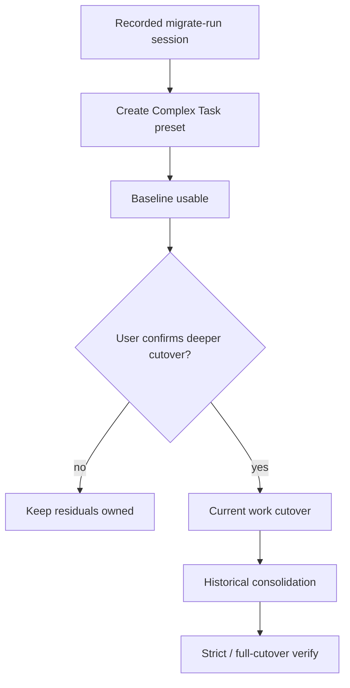

## Legacy Migration Preset Flow

```mermaid
flowchart TD
  A["Recorded migrate-run session"] --> B["Create Complex Task preset"]
  B --> C["Baseline usable"]
  C --> D{"User confirms deeper cutover?"}
  D -- no --> E["Keep residuals owned"]
  D -- yes --> F["Current work cutover"]
  F --> G["Historical consolidation"]
  G --> H["Strict / full-cutover verify"]
```
