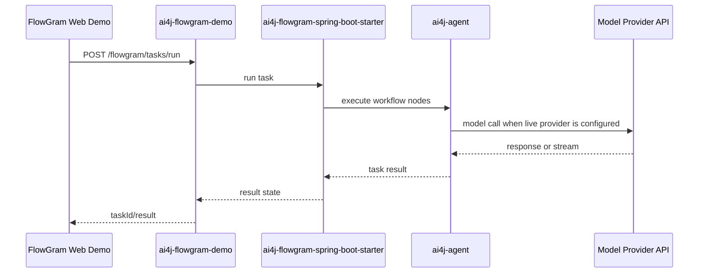

# 关键流程 / Critical Flows

Context Doc Type: critical-flows
Owner: project coordinator
Last Verified: 2026-06-04
Confidence: medium

## Flow Index

| Flow ID | Name | Trigger | Services | Business Impact | Source Evidence | Last Verified | Confidence |
| --- | --- | --- | --- | --- | --- | --- | --- |
| FLOW-001 | Provider chat/responses call | Application invokes SDK provider service. | `ai4j-core`, external provider APIs | Core SDK compatibility and auth/streaming behavior. | `ai4j/src/main/java`; README provider list | 2026-06-04 | medium |
| FLOW-002 | RAG/vector retrieval | Application configures vector store and RAG service. | `ai4j-core`, vector stores | Retrieval correctness and data-store compatibility. | `ai4j/src/main/java/io/github/lnyocly/ai4j/rag`; `.../vector` | 2026-06-04 | medium |
| FLOW-003 | Coding agent CLI session | User starts CLI/TUI/ACP coding workflow. | `ai4j-cli`, `ai4j-coding`, `ai4j-agent`, model provider APIs | CLI/runtime regressions can break coding-agent workflows. | `ai4j-cli/src/main/java`; `ai4j-coding/src/main/java` | 2026-06-04 | medium |
| FLOW-004 | FlowGram task run | Web demo/backend calls FlowGram task APIs. | `flowgram-web-demo`, `flowgram-demo`, `flowgram-starter`, `ai4j-agent` | Demo and starter integration path. | `ai4j-flowgram-demo/README.md`; `ai4j-flowgram-webapp-demo/rsbuild.config.ts` | 2026-06-04 | medium |
| FLOW-005 | Docs publication | Docs changes build through Docusaurus and GitHub Pages. | `docs-site`, GitHub Actions | Public docs availability. | `docs-site/package.json`; `.github/workflows/docs-build.yml`; `.github/workflows/docs-pages.yml` | 2026-06-04 | high |

## Representative Flow

FlowGram demo path:

