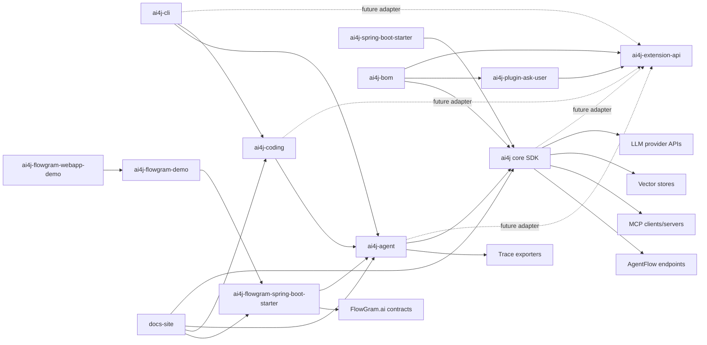

# 系统图谱 / System Map

Context Doc Type: system-map
Owner: project coordinator
Last Verified: 2026-06-09
Confidence: medium

## Scope

本图只描述当前 monorepo 内部模块和主要外部集成类别。接口 payload、auth、错误码和 contract tests 归入 `coding-agent-harness/context/integrations/`。

## Mermaid Map

## Map Evidence

| Node | Meaning | Source Evidence | Last Verified | Confidence |
| --- | --- | --- | --- | --- |
| `extension` | Lightweight extension API contract for manifest, discovery, enable/expose gates and neutral resources. | `AGENTS.md`; `ai4j-extension-api/src/main/java` | 2026-06-08 | high |
| `askUser` | Official sample plugin for host-mediated user clarification tool, command, Skill, and Prompt resources. | `ai4j-plugin-ask-user/src/main/java`; `docs-site/docs/core-sdk/extension/ask-user-plugin.md` | 2026-06-09 | high |
| `core` | Core SDK module and provider/RAG/MCP/vector owner. | `AGENTS.md`; `ai4j/src/main/java` | 2026-06-04 | high |
| `agent` | Agent runtime and orchestration module. | `AGENTS.md`; `AGENT.md`; `ai4j-agent/src/main/java` | 2026-06-04 | high |
| `coding` / `cli` | Coding-agent runtime and host surfaces. | `AGENTS.md`; `ai4j-coding/src/main/java`; `ai4j-cli/src/main/java` | 2026-06-04 | high |
| `flowStarter` / `flowDemo` / `flowWeb` | FlowGram starter, backend demo and frontend demo surfaces. | `AGENTS.md`; module package files | 2026-06-04 | high |
| external nodes | External systems are integration targets only; no external docs were supplied. | user confirmation 2026-06-04; README files; source tree names | 2026-06-04 | medium |
