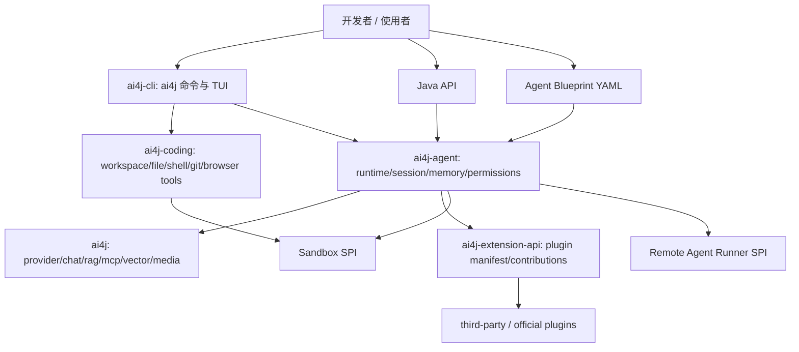

# AI4J Agent SDK / 云端 Agent Runner / Coding Agent CLI 产品化任务规划

> 记录日期：2026-06-21  
> Harness 任务：`MODULES/agent-runtime/2026-06-20-ai4j-agent-sdk-architecture-enhancement-roadmap-9effae81`  
> 记录性质：规划补充；不代表代码已经全部实现；后续实现必须单独开 task / worktree / PR。

## 1. 本轮要解决的问题

用户希望 AI4J 继续从“Java AI SDK + Agent 能力集合”升级为：

1. **更好用的 Java Agent SDK**：降低 Java 开发者接入模型、工具、RAG、Memory、Compact、Workflow、插件和沙箱的成本。
2. **可组装的 Agent 平台底座**：开发者可以通过 YAML Blueprint、插件和 Sandbox/Runner 抽象快速构建自己的 Agent 产品。
3. **接近 Codex / Claude Code / OpenCode / Pi 的 Coding Agent CLI/TUI**：安装后输入 `ai4j` 就能进入交互式 coding agent。
4. **支持云端 Agent 产品形态**：类似豆包、点点这类“对话 + 浏览器 + 命令 + 项目运行 + 文件产物”的远端执行体验，但 AI4J 不直接变成重型云平台。

本规划的核心原则：**能力可扩展，核心不过度膨胀；体验要简单，边界要清楚；文档必须真实可运行。**

## 2. 最重要的架构结论

| 议题 | 结论 | 原因 |
| --- | --- | --- |
| Agent SDK 核心模块 | 继续集中在 `ai4j-agent` | 已有模块边界足够；个人项目不应拆出过多核心 Maven。 |
| 对外核心名词 | 使用现有 `AgentRuntime`、`AgentSession`、`AgentFactory`、`AgentBlueprint` | 不新增 `Host Kernel` / `AgentHost` 这类用户不认可的新顶层概念。 |
| 开发者分层 | 不再强调“普通用户 / 进阶用户” | 使用者都是开发者，只是入口不同：Java API、YAML、CLI、插件。 |
| 插件生态 | 第三方可写、用户可装、能力显式启用 | 对标 Pi 的方向是“贡献点生态”，不是一个万能 Plugin 接口。 |
| Sandbox | 提供抽象、fake provider、插件接入点；不默认内置重型云平台 | 沙箱形态差异大，应该先稳定合同和路由，不强绑供应商。 |
| Remote Runner | 作为 Agent 产品化能力的 SPI | 帮小团队快速做云端 Agent 产品，但不承担完整云控制平面。 |
| CLI/TUI | 短期继续 Java + JLine，先补交互模型 | Ink/React 或自研 renderer 会显著增加维护成本。 |
| Harness | 保持项目治理工具，不内化进 `ai4j-agent` | `ai4j-cli` 可做可选检测/桥接，但 SDK 用户不应被迫接受 Harness。 |
| docs-site | 只写真实 API、真实命令、真实限制 | 之前最大问题不是不够“营销”，而是示例和能力说明不够真实完整。 |

## 3. 推荐产品分层



边界说明：

- `ai4j`：模型和基础 AI 能力。
- `ai4j-agent`：Agent SDK 的核心运行时。
- `ai4j-extension-api`：插件包契约和贡献点声明。
- `ai4j-coding`：coding agent 工具层。
- `ai4j-cli`：终端产品面、slash commands、安装入口。
- `docs-site`：真实教程和参考，不作为生产逻辑来源。

## 4. Sandbox / Remote Runner 的正确理解

### 4.1 三种运行形态

| 形态 | Agent 在哪里跑 | 工具在哪里执行 | 适合场景 |
| --- | --- | --- | --- |
| Direct host runtime | 当前 Java/CLI 进程 | 当前宿主机 | 普通 SDK 调用、低风险本地开发。 |
| Host-driven sandbox tools | 当前 Java/CLI 进程 | 外部 sandbox / VM / container / browser | SDK 用户想安全执行 shell、file、browser、project run。 |
| Remote Agent Runner | 远端隔离环境或 sandbox 内 | 同一个远端环境 | 云端 Agent 产品，每个会话有独立运行环境。 |

关键判断：

- 不使用 sandbox 时就是 direct host runtime，不需要叫“local sandbox”。
- Codex `/sandbox`、豆包/点点类产品，本质更接近“远端隔离执行环境 + 工具路由 + 权限/审计 + 产物回收”。
- AI4J SDK 有必要提供 **抽象和可测试实现**，但没有必要首版直接提供完整云沙箱平台。

### 4.2 隔离策略建议

| 策略 | 含义 | 建议 |
| --- | --- | --- |
| `PER_TASK_EPHEMERAL` | 每个高风险任务一个临时环境 | 高风险命令默认策略。 |
| `PER_SESSION` | 每个会话一个持久环境 | 云端 Agent 产品默认策略。 |
| `PER_USER_POOL` | 用户级环境池复用 | 仅低风险、强 reset、强配额时可选，不做默认。 |

对于“给每个用户/每个 Agent 都创建沙箱吗”的结论：

- 面向云端 Agent 产品，默认应是 **每个会话一个 sandbox/session**，便于隔离、复现、销毁和计费。
- 高风险工具可升级为每任务临时环境。
- 多用户共用一个 sandbox 只适合非常受控的低风险场景，不适合默认方案。

### 4.3 首版应提供的抽象

| 抽象 | 职责 |
| --- | --- |
| `SandboxSpec` | 镜像、资源、workspace、网络、超时、标签。 |
| `SandboxProvider` | 创建、恢复、销毁 sandbox session。 |
| `SandboxSession` | 生命周期状态、非敏感摘要、workspace ref。 |
| `SandboxCommand` / `SandboxResult` | 命令执行和 stdout/stderr/exit code/artifact refs。 |
| `SandboxArtifact` | 文件、截图、日志、构建产物引用。 |
| `SandboxBinding` | `AgentSession` 内保存的非敏感绑定摘要。 |
| `SandboxToolRouter` | 将 shell/file/browser/project tools 路由进 sandbox。 |
| `AgentRunnerSpec` | 远端 runner 的模型、blueprint、权限、sandbox 策略。 |
| `AgentRunnerClient` | event stream、取消、checkpoint、artifact 收集。 |

首版验证应以 fake provider / fake runner 为主，真实 CubeSandbox、Docker、K8s、VM、浏览器云等接入可以作为插件或示例后置。

## 5. Memory / Compact / Session 规划

### 5.1 设计目标

`AgentSession` 应该成为长程 Agent 的运行容器，统一承载：

- session metadata：id、title、workspace、labels、runner/sandbox 摘要。
- event log：user/model/tool/approval/compact/error/snapshot。
- memory：短期上下文、长期记忆、工具结果摘要。
- compact：手动压缩、阈值压缩、run boundary 压缩、失败回滚。
- context projection：按 token/预算把 memory、RAG、tool result、session state 组合给模型。
- snapshot/restore：便于 CLI/TUI 回放、远端 runner 恢复和测试。

### 5.2 参考原则

可以参考 Codex、Claude Code、OpenCode 等公开行为和公开分析里的优秀上下文管理思路，但必须遵守：

1. 只采纳公开资料和可验证行为，不复制泄露源码。
2. 公开资料结论先进入 R0 research digest，再进入 API 设计。
3. 设计要 provider-neutral，不绑定某个模型厂商。
4. compact report 要可解释：保留了什么、丢弃了什么、摘要了什么、预算如何变化。

## 6. YAML Agent Blueprint 规划

首版只做单 Agent Blueprint，不急于做复杂 team/workflow DSL。

```yaml
apiVersion: ai4j.io/v1alpha1
kind: Agent
metadata:
  name: research-assistant
model:
  provider: openai-compatible
  profile: default
instructions:
  system: "你是一个研究助手。"
memory:
  type: in-memory
  compact:
    strategy: token-threshold
tools:
  - ref: weather
plugins:
  - id: ask-user
permissions:
  tools:
    default: ask
sandbox:
  mode: optional
workflow:
  type: react
```

边界：

- YAML 只引用 profile/env/config key，不写真实密钥。
- YAML 不执行任意 Java 代码。
- `AgentFactory` 负责把 Blueprint 映射为真实 Agent。
- CLI 的 `ai4j run agent.yaml` 属于 `ai4j-cli`。
- schema 要可导出，给 docs-site、IDE、fixture、测试共用。

## 7. 插件生态规划

插件系统应由“贡献点”组成。

| 贡献点 | 宿主模块 | 作用 | 首版策略 |
| --- | --- | --- | --- |
| Resource | `ai4j-extension-api` | Prompt、Skill、模板、示例资源 | 安装后不自动执行。 |
| Tool | `ai4j-agent` | 注册 Agent tool | 必须显式 enable/expose。 |
| Lifecycle Hook | `ai4j-agent` | session/turn/tool/model/compact 观察 | observation-first。 |
| Guardrail | `ai4j-agent` | 输入、输出、tool call 检查 | 返回 allow/ask/deny 和原因。 |
| Memory / Compact | `ai4j-agent` | MemoryStore、CompactPolicy、ContextProjector | P0 稳定后开放。 |
| Sandbox Provider | `ai4j-agent` | 第三方沙箱接入 | P3/P4 稳定后开放。 |
| Runner Provider | `ai4j-agent` | 远端 Agent Runner 接入 | P5 后开放。 |
| CLI Command | `ai4j-cli` | `/command`、help、参数解析 | 先开放文本命令，TUI render plugin 暂缓。 |

插件安全默认：

- 安装插件不等于自动暴露危险能力。
- manifest 必须声明 capability、permission、resource、版本兼容范围。
- Shell/File/Browser/Sandbox/Network 类能力默认需要权限策略。
- docs-site 必须给出“如何写第三方插件”的完整样例。

## 8. Coding Agent CLI/TUI 规划

### 8.1 技术路线

- 短期继续 Java + JLine。
- 不引入 Ink 作为主栈。
- 不自研完整 terminal renderer。
- 把体验升级放在 view model、renderer abstraction、slash command、状态栏、消息分块、测试和安装入口。

### 8.2 目标体验

用户安装后，终端输入：

```bash
ai4j
```

进入交互式 coding agent，具备：

- provider / model / profile 切换。
- session 新建、恢复、摘要。
- memory / compact 状态查看和手动触发。
- plugin 查看、启用、禁用。
- sandbox attach/status/disable。
- markdown、代码块、diff、tool call、approval、error 分块渲染。
- `/help` 或 slash palette 可发现所有命令。

### 8.3 命令优先级

| 优先级 | 命令 | 说明 |
| --- | --- | --- |
| P0 | `/provider`, `/model`, `/session` | 最基础的当前身份和模型切换。 |
| P0 | `/memory`, `/compact`, `/compacts` | 长程上下文体验必须可见。 |
| P1 | `/plugins` / `/extension` | 插件生态入口。 |
| P1 | `/sandbox` | sandbox/runner 绑定状态和操作。 |
| P1 | `/permissions` | 危险工具授权策略。 |
| P2 | `/checkpoint` | session/workspace checkpoint。 |
| P2 | `/help` palette polish | 命令发现和快捷键。 |

## 9. 安装和分发规划

目标是让用户最终能“一条命令安装，然后输入 `ai4j` 使用”。

候选方案必须单独调研，不在本规划直接拍死：

| 方案 | 优点 | 风险 |
| --- | --- | --- |
| zip + scripts | Java 项目最直接，可控 | 体验不如一条包管理命令。 |
| JBang | Java CLI 友好，启动快 | 用户需要接受 JBang 生态。 |
| npm wrapper | 前端/AI 工具用户熟悉 `npx/npm i -g` | Java CLI 变成 Node wrapper，维护两套分发。 |
| native-image | 体验最好 | 构建复杂、反射/依赖兼容成本高。 |
| Homebrew/Scoop/Sdkman | 正式分发友好 | 发布链路较长，适合稳定后。 |

建议首个任务先做 packaging decision record + 最小 prototype，再决定主分发路径。

## 10. docs-site 规划

每个能力页必须按固定结构写清楚：

1. 这个能力解决什么问题。
2. 什么时候该用，什么时候不该用。
3. 最小可运行 Java / YAML / CLI 示例。
4. 核心 API / 字段解释。
5. 与其他模块的关系。
6. 安全边界和限制。
7. 常见错误和排查。
8. 测试、demo 或源码入口。
9. 下一步链接。

明确禁止：

- 不写不存在的 API。
- 不用 roadmap 代替教程。
- 不写“企业采用”这种不自然措辞。
- 不把具体中转平台名写成 SDK 架构概念，只写 `openai-compatible`。
- 不让 docs-site 成为生产逻辑的唯一事实来源。

## 11. 推荐任务队列

执行前必须重新以最新 `origin/dev`、PR 状态、`npx --yes coding-agent-harness status --json .` 校准，不从旧对话判断。

| 顺序 | 任务 | 主模块 | 产物 | 验证 |
| ---: | --- | --- | --- | --- |
| 0 | Backlog / review queue reconciliation | Harness | 区分已实现、待确认、需 closeout、需 supersede 的任务 | `harness status --json .` |
| 1 | R0 source-backed research digest | Harness / docs-site | Pi/Codex/Claude/OpenCode/Java SDK/Sandbox 公开资料 digest | docs build + source links |
| 2 | Session / Memory / Compact 收口 | `ai4j-agent` + `ai4j-cli` | session/memory/compact API 与 CLI 可诊断体验 | agent/cli targeted tests |
| 3 | Blueprint schema hardening | `ai4j-agent` | schema/model/loader/validator/export 兼容测试 | blueprint targeted tests |
| 4 | Plugin contribution contract hardening | `ai4j-extension-api` + `ai4j-agent` | tool/hook/guardrail/memory/sandbox/command 贡献模型 | extension/agent tests |
| 5 | Sandbox SPI + tool routing | `ai4j-agent` + `ai4j-coding` | fake provider、binding、shell/file/browser/project routing | sandbox/coding tests |
| 6 | CLI `/sandbox` + TUI 状态体验 | `ai4j-cli` | sandbox/memory/plugin/provider/model/session 状态清楚 | cli tests + smoke |
| 7 | Remote Agent Runner SPI | `ai4j-agent` | runner spec/client/event stream/fake runner | runner tests |
| 8 | One-command install prototype | `ai4j-cli` | 分发方案 ADR + 最小安装包 | packaging smoke |
| 9 | docs-site completeness pass | `docs-site` | 每个真实能力页讲清楚 | `npm --prefix docs-site run build` |

## 12. 每个实现切片的固定门禁

1. 新建或复用 Harness task package。
2. 非平凡代码使用 dedicated worktree / branch。
3. 保持 Java 8 兼容。
4. 不提交 token、secret、本机路径或 sandbox 凭证。
5. 新增 public API 必须有 owner module tests。
6. CLI/TUI 改动至少覆盖 parser、view model、runtime dispatch、ACP 或 docs 一致性。
7. docs-site 改动运行 `npm --prefix docs-site run build`。
8. 新增固定回归面时同步 `docs/05-TEST-QA/Regression-SSoT.md` 和 `docs/05-TEST-QA/Cadence-Ledger.md`。
9. closeout 前更新 task-local `review.md`、`walkthrough.md`、`lesson_candidates.md`、progress evidence。

## 13. 本规划不做的事

- 不实现代码。
- 不新增核心 Maven 模块。
- 不承诺内置某个真实 sandbox 供应商。
- 不复制或依赖泄露源码。
- 不把 Harness 内化进 `ai4j-agent`。
- 不写不存在的 API 示例。

## 14. 下一位 Agent 的入口

1. 从最新 `origin/dev` 新建 worktree，不在规划分支直接写生产代码。
2. 先运行 `git status --short --branch` 与 `npx --yes coding-agent-harness status --json .`。
3. 先做 backlog/review reconciliation，避免重复实现已完成任务。
4. 需要调研 Pi/Codex/Claude/OpenCode 时，先写 source-backed digest，再修改架构计划。
5. 选择推荐队列中第一个未完成且依赖满足的实现切片，单独 task/worktree/PR 推进。
