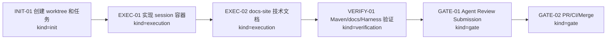
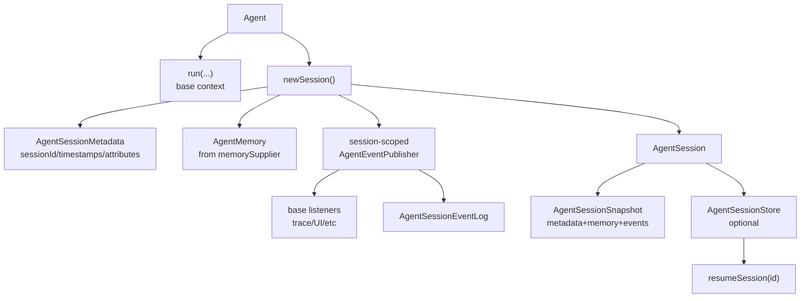
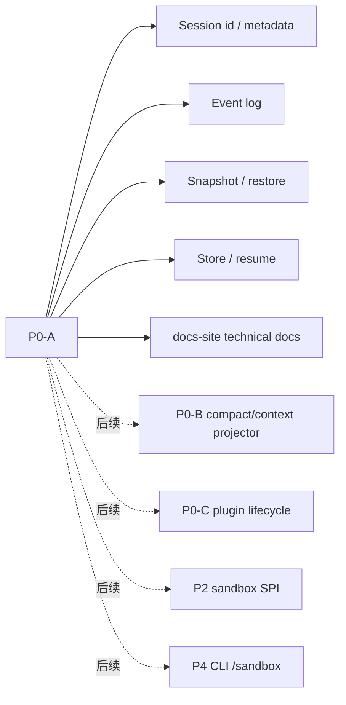

# Visual Map / 可视化图谱

Visual Map Contract: v1.0

## 图表索引（Map Index）

| ID | Type | Purpose | Required For Understanding | Source Evidence | Promotion Candidate |
| --- | --- | --- | --- | --- | --- |
| MAP-01 | phase | 展示 P0-A 执行阶段和门禁 | yes | `task_plan.md` | no |
| MAP-02 | architecture | 展示 AgentSession runtime container 关系 | yes | `references/agent-session-runtime-container-design.md` | no |
| MAP-03 | scope | 展示 P0-A 范围和后续排除项 | yes | `execution_strategy.md` | no |

## 阶段关系图（Phase Graph）

## 阶段表（Phase Table，表头供 checker 解析）

| Phase ID | Kind | Depends On | State | Completion | Output | Required Evidence | Exit Command | Actor | Evidence Status | Blocking Risk | Owner / Handoff |
| --- | --- | --- | --- | ---: | --- | --- | --- | --- | --- | --- | --- |
| INIT-01 | init | none | done | 100 | worktree 和任务包已创建并 task-start | `git worktree list`; `progress.md` task-start | `harness task-start MODULES/agent-runtime/2026-06-20-p0-a-agentsession-runtime-container-389dbf12` | agent | present | none | coordinator |
| EXEC-01 | execution | INIT-01 | done | 100 | AgentSession metadata/event log/snapshot/store/resume 基础实现 | `ai4j-agent/src/main/java/io/github/lnyocly/ai4j/agent/session/*`; `Agent.java`; `AgentSession.java`; `AgentBuilder.java` | n/a | agent | present | broad regression pending | coordinator |
| EXEC-02 | execution | EXEC-01 | done | 100 | docs-site Agent Session Runtime 页面和 roadmap/sidebar 接入 | `docs-site/docs/agent/session-runtime.md`; `docs-site/docs/agent/sdk-roadmap.md`; `docs-site/sidebars.ts` | n/a | agent | present | docs build pending | coordinator |
| VERIFY-01 | execution | EXEC-02 | done | 100 | targeted/broad Maven 和 docs-site build 已过；Harness status 格式修复后重跑 | targeted test; RG-002 broad test; RG-008 docs build | `mvn -pl ai4j-agent -am -DskipTests=false test`; `npm run build`; `npx --yes coding-agent-harness status --json .` | agent | present | final harness status rerun pending | coordinator |
| GATE-01 | gate | VERIFY-01 | planned | 0 | Agent Review Submission | `review.md`; `lesson_candidates.md`; final progress evidence | `harness task-review MODULES/agent-runtime/2026-06-20-p0-a-agentsession-runtime-container-389dbf12 --message "
" .` | agent | missing | cannot submit before clean commit/materials | coordinator |
| GATE-02 | gate | GATE-01 | planned | 0 | PR、CI 和 merge | GitHub PR checks and merge commit | `gh pr create`; `gh pr checks --watch`; `gh pr merge` or API merge | agent | missing | remote CI may fail | coordinator |

## AgentSession Runtime Container

## 当前任务范围

## Evidence Map

| Evidence | Path |
| --- | --- |
| session code | `ai4j-agent/src/main/java/io/github/lnyocly/ai4j/agent/session/` |
| builder/session wiring | `ai4j-agent/src/main/java/io/github/lnyocly/ai4j/agent/Agent.java`; `AgentBuilder.java`; `AgentSession.java` |
| tests | `ai4j-agent/src/test/java/io/github/lnyocly/agent/AgentSessionRuntimeContainerTest.java` |
| docs | `docs-site/docs/agent/session-runtime.md`; `docs-site/docs/agent/sdk-roadmap.md`; `docs-site/sidebars.ts` |
