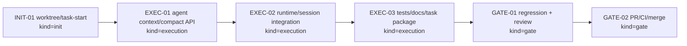
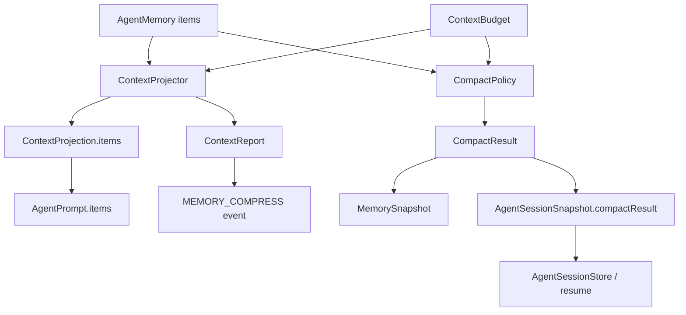

# Visual Map / 可视化图谱

Visual Map Contract: v1.0

## 图表索引（Map Index）

| ID | Type | Purpose | Required For Understanding | Source Evidence | Promotion Candidate |
| --- | --- | --- | --- | --- | --- |
| MAP-01 | phase | 展示 P0-B 执行阶段和门禁 | yes | `task_plan.md` | no |
| MAP-02 | data-flow | 展示 memory -> projector -> prompt/report -> compact/session snapshot 的数据流 | yes | code diff / tests | yes |

## 阶段关系图（Phase Graph）

## 阶段表（Phase Table，表头供 checker 解析）

| Phase ID | Kind | Depends On | State | Completion | Output | Required Evidence | Exit Command | Actor | Evidence Status | Blocking Risk | Owner / Handoff |
| --- | --- | --- | --- | ---: | --- | --- | --- | --- | --- | --- | --- |
| INIT-01 | init | none | done | 100 | worktree 和任务包已创建并 task-start | `git worktree list`; `progress.md` task-start | `harness task-start MODULES/agent-runtime/2026-06-20-p0-b-memory-compact-context-projector-47effd57` | agent | present | none | coordinator |
| EXEC-01 | execution | INIT-01 | done | 100 | context projector 与 compact policy API 已实现 | `ai4j-agent/src/main/java/io/github/lnyocly/ai4j/agent/context/*`; `compact/*` | n/a | agent | present | broad regression pending | coordinator |
| EXEC-02 | execution | EXEC-01 | done | 100 | runtime prompt projection 和 session compact snapshot/save/resume 已接入 | `BaseAgentRuntime.java`; `CodeActRuntime.java`; `AgentSession.java`; `AgentSessionSnapshot.java` | n/a | agent | present | broad regression pending | coordinator |
| EXEC-03 | execution | EXEC-02 | done | 100 | P0-B targeted tests 和 docs-site 页面已补齐 | `AgentMemoryCompactContextProjectorTest.java`; `docs-site/docs/agent/memory-compact-context.md` | targeted Maven + docs build | agent | partial | broad/docs/harness final pending | coordinator |
| GATE-01 | gate | EXEC-03 | planned | 0 | Agent Review Submission | `review.md`; regression evidence; lesson routing | `harness task-review MODULES/agent-runtime/2026-06-20-p0-b-memory-compact-context-projector-47effd57 --message "
" .` | agent | missing | final checks pending | coordinator |
| GATE-02 | gate | GATE-01 | planned | 0 | PR、CI 和 merge | GitHub PR checks and merge commit | `gh pr create`; `gh pr checks --watch`; merge | agent | missing | remote CI may fail | coordinator |

允许的 `State`：`planned`, `in_progress`, `review`, `blocked`, `done`, `skipped`。
允许的 `Evidence Status`：`missing`, `partial`, `present`, `waived`。
允许的 `Kind`：`init`, `execution`, `gate`。
允许的 `Actor`：`agent`, `human`, `coordinator`。
`Completion` 使用 `0..100` 的整数；`done` 应为 `100`，`planned` 应为 `0`，`skipped` 不计入 dashboard 总完成度。

## 支持性图表（Supporting Maps）

### MAP-02 Memory / Compact / Context 数据流

