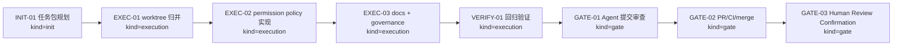
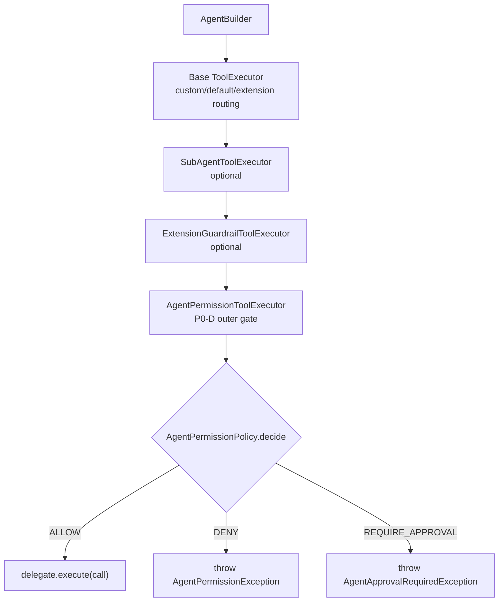
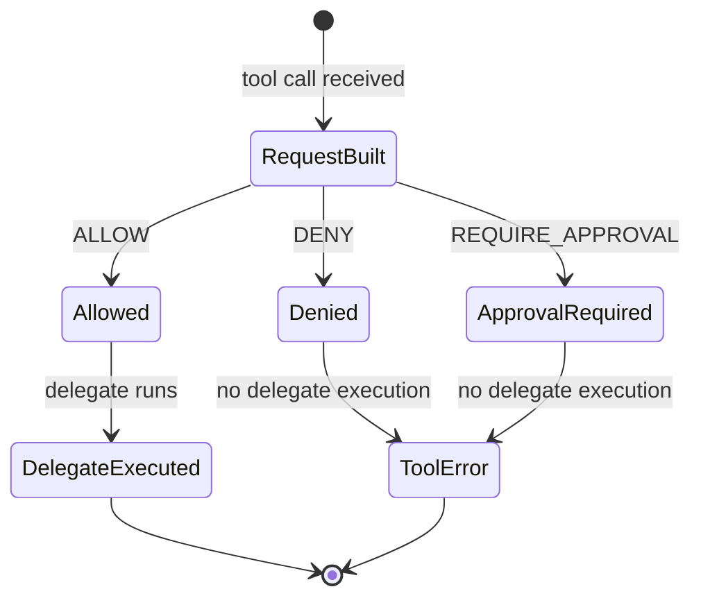
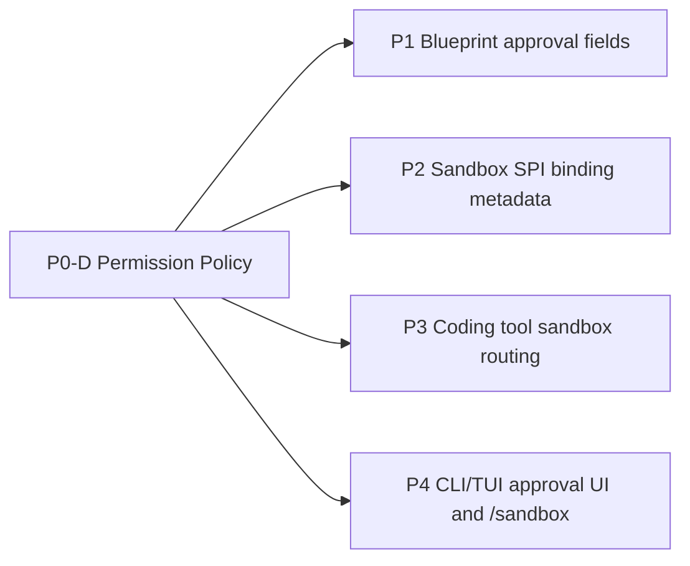

# Visual Map / 可视化图谱

Visual Map Contract: v1.0

本文件是任务图表集合，不只是阶段路线图。只有对人或 agent 理解任务有实际帮助的图才放进来。

## 图表索引（Map Index）

| ID | Type | Purpose | Required For Understanding | Source Evidence | Promotion Candidate |
| --- | --- | --- | --- | --- | --- |
| MAP-01 | phase | 展示 P0-D 从状态归并到验证/审查的阶段依赖 | yes | `task_plan.md` | no |
| MAP-02 | architecture | 展示 permission policy 在 agent tool execution chain 中的位置 | yes | `AgentBuilder.java`, `ToolExecutor.java` | no |
| MAP-03 | state | 展示 permission decision 的状态语义 | yes | `references/p0-d-agent-approval-permission-policy-plan.md` | no |

## 阶段关系图（Phase Graph）

## 阶段表（Phase Table，表头供 checker 解析）

| Phase ID | Kind | Depends On | State | Completion | Output | Required Evidence | Exit Command | Actor | Evidence Status | Blocking Risk | Owner / Handoff |
| --- | --- | --- | --- | ---: | --- | --- | --- | --- | --- | --- | --- |
| INIT-01 | init | none | done | 100 | 任务计划和执行策略已确认 | `task_plan.md`; `execution_strategy.md`; `findings.md` | `harness task-start MODULES/agent-runtime/2026-06-20-p0-d-agent-approval-and-permission-policy-95b57bb5` | agent | present | none | coordinator |
| EXEC-01 | execution | INIT-01 | done | 100 | P0-D 实现差异已归并到专用 worktree，main 已恢复 clean | `git status`; worktree diff | manual copy/rebuild then main cleanup | agent | present | none | coordinator |
| EXEC-02 | execution | EXEC-01 | done | 100 | Agent permission policy API、ToolExecutor wrapper、Builder/Context wiring、tests 已实现 | `ai4j-agent/src/main/java/.../permission/*`; `AgentApprovalPermissionPolicyTest` | `mvn -pl ai4j-agent -am "-Dtest=AgentApprovalPermissionPolicyTest" -DskipTests=false -DfailIfNoTests=false test` | agent | present | none | coordinator |
| EXEC-03 | execution | EXEC-02 | done | 100 | docs-site 页面、sidebar/roadmap、Regression SSoT、Cadence Ledger、module_plan 已更新 | docs/governance diff | n/a | agent | present | docs-site ignored files require `git add -f` | coordinator |
| VERIFY-01 | execution | EXEC-03 | done | 100 | targeted tests、agent module tests、docs build、harness status、diff check 已通过 | command evidence in `progress.md` | test/build/status commands | agent | present | none | coordinator |
| GATE-01 | gate | VERIFY-01 | done | 100 | Agent Review Submission | `review.md`; `lesson_candidates.md`; final progress evidence | `harness task-review MODULES/agent-runtime/2026-06-20-p0-d-agent-approval-and-permission-policy-95b57bb5 --message "
" .` | agent | present | cannot submit before clean commit/materials | coordinator |
| GATE-02 | gate | GATE-01 | planned | 0 | PR、CI 和 merge | PR URL; CI checks; merge SHA | `gh pr create`; `gh pr checks --watch`; merge | agent | missing | remote CI may fail | coordinator |
| GATE-03 | gate | GATE-02 | planned | 0 | Human Review Confirmation | review packet 和人工确认 | dashboard workbench confirmation / `review-confirm` | human | missing | Agent 不能代办人工确认 | human |

允许的 `State`：`planned`, `in_progress`, `review`, `blocked`, `done`, `skipped`。

允许的 `Evidence Status`：`missing`, `partial`, `present`, `waived`。

允许的 `Kind`：`init`, `execution`, `gate`。

允许的 `Actor`：`agent`, `human`, `coordinator`。

`Completion` 使用 `0..100` 的整数；`done` 应为 `100`，`planned` 应为 `0`，`skipped` 不计入 dashboard 总完成度。dashboard 的实现完成度只由非 skipped 的 `execution` 阶段计算；`init` 和 `gate` 阶段表达生命周期门禁、下一步命令和责任人，不拉低实现完成度。

## 支持性图表（Supporting Maps）

### MAP-02：执行链位置

### MAP-03：决策状态

### MAP-04：后续能力接续关系

