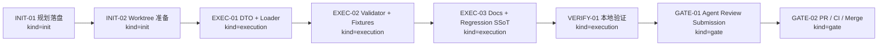
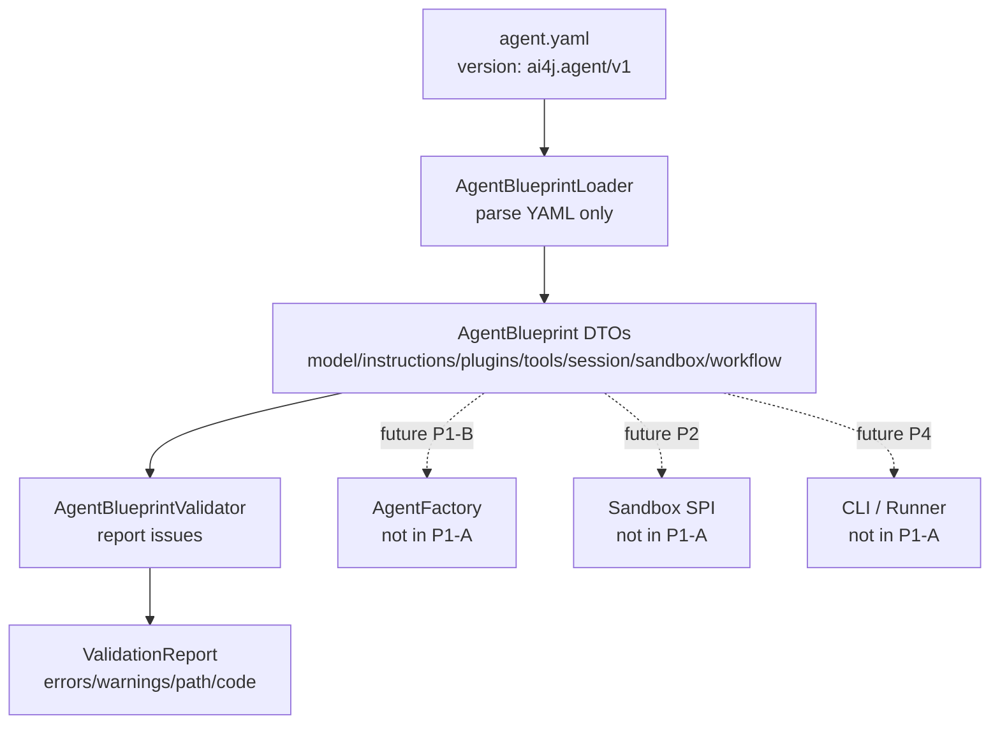

# Visual Map / 可视化图谱

Visual Map Contract: v1.0

本文件是 P1-A Agent Blueprint 任务图表集合，帮助下一轮 agent 快速理解执行阶段、字段边界和验证链路。

## 图表索引（Map Index）

| ID | Type | Purpose | Required For Understanding | Source Evidence | Promotion Candidate |
| --- | --- | --- | --- | --- | --- |
| MAP-01 | phase | 展示 P1-A 从规划到 review/PR 的阶段关系 | yes | `task_plan.md` | no |
| MAP-02 | architecture | 展示 YAML -> DTO -> validator -> future factory 的边界 | yes | `references/agent-blueprint-p1a-execution-plan.md` | no |

## 阶段关系图（Phase Graph）

## 架构边界图（Architecture Map）

## 阶段表（Phase Table，表头供 checker 解析）

| Phase ID | Kind | Depends On | State | Completion | Output | Required Evidence | Exit Command | Actor | Evidence Status | Blocking Risk | Owner / Handoff |
| --- | --- | --- | --- | ---: | --- | --- | --- | --- | --- | --- | --- |
| INIT-01 | init | none | done | 100 | 任务计划、reference plan 和执行策略已记录 | `brief.md`; `task_plan.md`; `execution_strategy.md`; `references/agent-blueprint-p1a-execution-plan.md` | `npx --yes coding-agent-harness task-start MODULES/agent-runtime/2026-06-20-p1-a-agent-blueprint-schema-model-loader-validat-b05250a0 ... .` | agent | present | none | coordinator |
| INIT-02 | init | INIT-01 | planned | 0 | 创建 feature worktree 和分支 | `git worktree list`; branch status | `git worktree add .worktrees/feature/agent-blueprint-schema-loader -b feature/agent-blueprint-schema-loader main` | agent | missing | worktree cleanup required after merge | coordinator |
| EXEC-01 | execution | INIT-02 | done | 100 | `AgentBlueprint` DTO 和 loader | diff in `ai4j-agent/src/main/java/.../blueprint`; loader tests | n/a | agent | present | YAML dependency / Java 8 compatibility | coordinator or authorized worker |
| EXEC-02 | execution | EXEC-01 | done | 100 | Validator、report、issue 和 fixtures | `AgentBlueprintLoaderValidatorTest`; fixtures under test resources | n/a | agent | present | deterministic errors and field scope drift | coordinator or authorized worker |
| EXEC-03 | execution | EXEC-02 | done | 100 | docs-site Agent Blueprint 页面和回归治理同步 | `docs-site/docs/agent/agent-blueprint.md`; sidebar/roadmap; Regression SSoT if needed | n/a | agent | present | docs/code drift | coordinator |
| VERIFY-01 | execution | EXEC-03 | planned | 0 | targeted/module/docs/Harness 验证通过 | Maven tests; `npm run build`; `harness status --json`; `git diff --check` | see `task_plan.md` verification commands | agent | missing | local deps / docs-site node_modules availability | coordinator |
| GATE-01 | gate | VERIFY-01 | planned | 0 | Agent Review Submission | `review.md`; `walkthrough.md`; lesson decision; clean tree | `npx --yes coding-agent-harness task-review MODULES/agent-runtime/2026-06-20-p1-a-agent-blueprint-schema-model-loader-validat-b05250a0 --message "
" .` | agent | missing | cannot submit before verification evidence and clean commit | coordinator |
| GATE-02 | gate | GATE-01 | planned | 0 | PR、CI、merge 和 worktree cleanup | PR URL/checks/merge SHA; `git worktree list` | `gh pr create`; `gh pr checks --watch`; merge and cleanup | human | missing | remote CI may fail; Agent 不能代办人工确认 | human / coordinator |

允许的 `State`：`planned`, `in_progress`, `review`, `blocked`, `done`, `skipped`。

允许的 `Evidence Status`：`missing`, `partial`, `present`, `waived`。

允许的 `Kind`：`init`, `execution`, `gate`。

允许的 `Actor`：`agent`, `human`, `coordinator`。

`Completion` 使用 `0..100` 的整数；`done` 应为 `100`，`planned` 应为 `0`，`skipped` 不计入 dashboard 总完成度。dashboard 的实现完成度只由非 skipped 的 `execution` 阶段计算；`init` 和 `gate` 阶段表达生命周期门禁、下一步命令和责任人，不拉低实现完成度。
