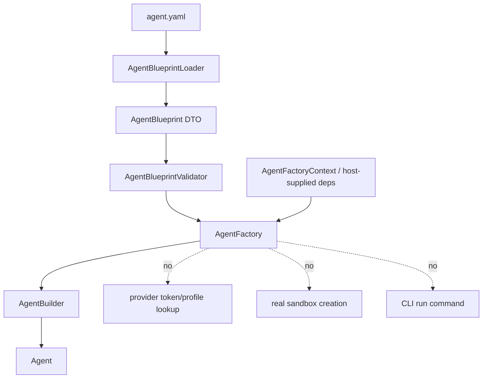

# Visual Map / 可视化图谱

Visual Map Contract: v1.0

## 图表索引（Map Index）

| ID | Type | Purpose | Required For Understanding | Source Evidence | Promotion Candidate |
| --- | --- | --- | --- | --- | --- |
| MAP-01 | phase | P1-B phase graph | yes | `task_plan.md` | no |
| MAP-02 | architecture | Blueprint Factory boundary | yes | `references/agent-blueprint-p1b-factory-plan.md` | no |

## 阶段关系图（Phase Graph）

```mermaid
flowchart LR
  INIT01["INIT-01 规划落盘"] --> INIT02["INIT-02 Worktree 准备"]
  INIT02 --> EXEC01["EXEC-01 Factory API"]
  EXEC01 --> EXEC02["EXEC-02 Mapping + Exception"]
  EXEC02 --> EXEC03["EXEC-03 Tests"]
  EXEC03 --> EXEC04["EXEC-04 Docs + Regression"]
  EXEC04 --> VERIFY01["VERIFY-01 本地验证"]
  VERIFY01 --> GATE01["GATE-01 Agent Review Submission"]
  GATE01 --> GATE02["GATE-02 PR / CI / Merge"]
```

## 架构边界图（Architecture Map）

## 阶段表（Phase Table，表头供 checker 解析）

| Phase ID | Kind | Depends On | State | Completion | Output | Required Evidence | Exit Command | Actor | Evidence Status | Blocking Risk | Owner / Handoff |
| --- | --- | --- | --- | ---: | --- | --- | --- | --- | --- | --- | --- |
| INIT-01 | init | none | done | 100 | 任务计划和 reference 已记录 | `task_plan.md`; `references/agent-blueprint-p1b-factory-plan.md` | `harness task-start ...` | agent | present | none | coordinator |
| INIT-02 | init | INIT-01 | planned | 0 | 创建 `.wt/p1b` worktree 和分支 | `git worktree list`; branch status | `git worktree add .wt/p1b -b feature/agent-blueprint-factory main` | agent | missing | cleanup required after merge | coordinator |
| EXEC-01 | execution | INIT-02 | planned | 0 | Factory API 和 context/resolver | `AgentFactory*` source diff | n/a | agent | missing | API surface creep | coordinator |
| EXEC-02 | execution | EXEC-01 | planned | 0 | Blueprint to builder mapping | mapping tests | n/a | agent | missing | provider/secret coupling | coordinator |
| EXEC-03 | execution | EXEC-02 | planned | 0 | deterministic tests | `AgentBlueprintFactoryTest` | n/a | agent | missing | live provider accidental use | coordinator |
| EXEC-04 | execution | EXEC-03 | planned | 0 | docs-site 和 regression 更新 | docs page; Regression SSoT/Cadence | n/a | agent | missing | docs/code drift | coordinator |
| VERIFY-01 | execution | EXEC-04 | planned | 0 | targeted/broad/docs/Harness/diff 通过 | Maven/docs/Harness/diff outputs | see task_plan | agent | missing | local deps | coordinator |
| GATE-01 | gate | VERIFY-01 | planned | 0 | Agent Review Submission | `review.md`; `walkthrough.md`; clean tree | `harness task-review ...` | agent | missing | missing materials | coordinator |
| GATE-02 | gate | GATE-01 | planned | 0 | PR、CI、merge 和 cleanup | PR URL/checks/merge SHA | `gh pr create`; CI; merge | human | missing | remote CI | coordinator |

允许的 `State`：`planned`, `in_progress`, `review`, `blocked`, `done`, `skipped`。
允许的 `Evidence Status`：`missing`, `partial`, `present`, `waived`。
