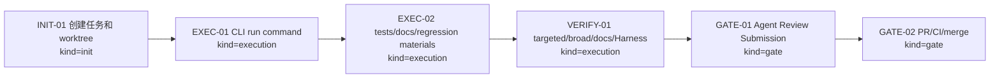

# Visual Map / 可视化图谱 - P1-C CLI run Agent Blueprint YAML

Visual Map Contract: v1.0

## 图表索引（Map Index）

| ID | Type | Purpose | Required For Understanding | Source Evidence | Promotion Candidate |
| --- | --- | --- | --- | --- | --- |
| MAP-01 | phase | 展示 P1-C 执行阶段和门禁 | yes | `task_plan.md` | no |
| MAP-02 | dataflow | 展示 CLI run 从 YAML 到 Agent run 的数据流 | yes | `AgentBlueprintRunCommand.java` | no |
| MAP-03 | boundary | 展示 token/profile/sandbox 边界 | yes | `review.md` / docs-site | no |

## 阶段关系图（Phase Graph）



## 阶段表（Phase Table，表头供 checker 解析）

| Phase ID | Kind | Depends On | State | Completion | Output | Required Evidence | Exit Command | Actor | Evidence Status | Blocking Risk | Owner / Handoff |
| --- | --- | --- | --- | ---: | --- | --- | --- | --- | --- | --- | --- |
| INIT-01 | init | none | done | 100 | `.wt/p1c` worktree and task-start | `git worktree list`; `progress.md` | `harness task-start ...` | coordinator | present | none | coordinator |
| EXEC-01 | execution | INIT-01 | done | 100 | `AgentBlueprintRunCommand` and top-level `run` dispatch | source diff; targeted compile | n/a | coordinator | present | none | coordinator |
| EXEC-02 | execution | EXEC-01 | in_progress | 80 | tests, docs, regression docs, task materials | targeted tests passed; docs/regression pending | n/a | coordinator | partial | broad/docs/Harness pending | coordinator |
| VERIFY-01 | execution | EXEC-02 | planned | 0 | broad CLI/docs/Harness/diff checks | command outputs | n/a | coordinator | missing | verification incomplete | coordinator |
| GATE-01 | gate | VERIFY-01 | planned | 0 | Agent Review Submission | `review.md`; `task-review` | `npx --yes coding-agent-harness task-review ...` | coordinator | missing | not submitted | coordinator |
| GATE-02 | gate | GATE-01 | planned | 0 | PR/CI/merge/cleanup | PR URL; CI checks; merge commit | `gh pr create/checks/merge` | coordinator | missing | remote pending | coordinator |

允许的 `State`：`planned`, `in_progress`, `review`, `blocked`, `done`, `skipped`。

## MAP-02 CLI run 数据流

```text
ai4j-cli run agent.yaml --input "task"
  -> parse args
  -> AgentBlueprintLoader.load(path)
  -> resolve model/profile/provider via CliProviderConfigManager.resolveWithProfile(...)
  -> reject missing/incompatible explicit profile
  -> DefaultAgentBlueprintRunModelClientFactory.create(options)
  -> AgentFactory.create(blueprint, AgentFactoryContext.modelClient(...))
  -> Agent.run(AgentRequest.input(...))
  -> print AgentResult.outputText
```

## MAP-03 边界图

```text
YAML Blueprint
  contains: id/name/model/profile/instructions/tools/session/sandbox/workflow
  does not contain: provider token, secret, installed plugin, real sandbox session

CLI host
  may read: CLI profile/env/properties/--api-key/--base-url
  must not commit: tokens or local secrets
  supplies: AgentModelClient

AgentFactory
  reads: Blueprint + explicit AgentFactoryContext
  does not read: env, user profile, token store

Sandbox
  enabled=true default: fail with blueprint.sandbox.unsupported
  --allow-sandbox-declaration: only accepts declaration, no VM/container created
```

## Evidence Map

| Evidence | Path |
| --- | --- |
| Run command | `ai4j-cli/src/main/java/io/github/lnyocly/ai4j/cli/command/AgentBlueprintRunCommand.java` |
| CLI top-level routing | `ai4j-cli/src/main/java/io/github/lnyocly/ai4j/cli/Ai4jCli.java` |
| Provider profile resolution | `ai4j-cli/src/main/java/io/github/lnyocly/ai4j/cli/provider/CliProviderConfigManager.java` |
| Deterministic tests | `ai4j-cli/src/test/java/io/github/lnyocly/ai4j/cli/command/AgentBlueprintRunCommandTest.java` |
| Docs | `docs-site/docs/agent/agent-blueprint.md` |
| Regression gates | `docs/05-TEST-QA/Regression-SSoT.md`; `docs/05-TEST-QA/Cadence-Ledger.md` |
