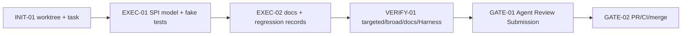

# Visual Map / 可视化图谱

Visual Map Contract: v1.0

## Map Index

| ID | Type | Purpose | Required For Understanding | Source Evidence | Promotion Candidate |
| --- | --- | --- | --- | --- | --- |
| MAP-01 | phase | P2-A 执行阶段 | yes | `task_plan.md` | no |
| MAP-02 | architecture | Sandbox SPI 边界 | yes | source diff / docs-site | yes |

## Phase Graph



## Phase Table

| Phase ID | Kind | Depends On | State | Completion | Output | Required Evidence | Exit Command | Actor | Evidence Status | Blocking Risk | Owner / Handoff |
| --- | --- | --- | --- | ---: | --- | --- | --- | --- | --- | --- | --- |
| INIT-01 | init | none | done | 100 | `.wt/p2a` and task-start | `git worktree list`; `progress.md` | `harness task-start ...` | coordinator | present | none | coordinator |
| EXEC-01 | execution | INIT-01 | done | 100 | Sandbox SPI model and fake provider tests | source diff; targeted tests | n/a | coordinator | present | none | coordinator |
| EXEC-02 | execution | EXEC-01 | done | 100 | docs-site page and regression records | docs diff; regression docs diff | n/a | coordinator | present | none | coordinator |
| VERIFY-01 | execution | EXEC-02 | done | 100 | targeted/broad/docs checks | command outputs | n/a | coordinator | present | final Harness status pending | coordinator |
| GATE-01 | gate | VERIFY-01 | planned | 0 | Agent Review Submission | `review.md`; `task-review` | `harness task-review ...` | coordinator | missing | not submitted yet | coordinator |
| GATE-02 | gate | GATE-01 | planned | 0 | PR/CI/merge/cleanup | PR URL; CI checks; merge commit | `gh pr create/checks/merge` | coordinator | missing | remote pending | coordinator |

## MAP-02 Sandbox SPI Boundary

```text
Permission Policy
  decides whether a tool may run
        |
        v
SandboxProvider
  creates SandboxSession from SandboxSpec
        |
        v
SandboxSession
  execute(SandboxCommand)
        |
        v
SandboxResult
  exitCode / stdout / stderr / timeout / cancel
  SandboxArtifact[]
  SandboxEvent[]

P2-A: contract only + fake provider tests
P2-B: AgentSession binding
P2-C: plugin contribution
P3: ai4j-coding routing
P4: CLI/TUI /sandbox UX
```
