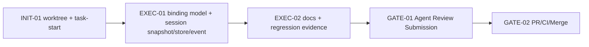

# Visual Map / 可视化图谱

Visual Map Contract: v1.0

## 图表索引（Map Index）

| ID | Type | Purpose | Required For Understanding | Source Evidence | Promotion Candidate |
| --- | --- | --- | --- | --- | --- |
| MAP-01 | phase | P2-B 执行阶段和门禁 | yes | `task_plan.md` | no |
| MAP-02 | architecture | AgentSession sandbox binding 数据流 | yes | `AgentSessionSandboxBinding.java` | yes |

## 阶段关系图（Phase Graph）



## 阶段表（Phase Table，表头供 checker 解析）

| Phase ID | Kind | Depends On | State | Completion | Output | Required Evidence | Exit Command | Actor | Evidence Status | Blocking Risk | Owner / Handoff |
| --- | --- | --- | --- | ---: | --- | --- | --- | --- | --- | --- | --- |
| INIT-01 | init | none | done | 100 | worktree 和 task-start 完成 | `git worktree list`; `task-start` | `harness task-start MODULES/agent-runtime/2026-06-20-p2-b-agentsession-sandbox-binding-e8175553` | agent | present | none | coordinator |
| EXEC-01 | execution | INIT-01 | in_progress | 70 | binding model、snapshot/store/event log 和 targeted test | `AgentSessionSandboxBindingTest` | n/a | agent | present | broad/docs pending | coordinator |
| EXEC-02 | execution | EXEC-01 | planned | 0 | docs-site 和 regression evidence | docs build; regression docs | n/a | agent | missing | docs/broad pending | coordinator |
| GATE-01 | gate | EXEC-02 | done | 100 | Agent Review Submission | `review.md`; lesson decision; harness status | `harness task-review ...` | agent | present | pending validation | coordinator |
| GATE-02 | gate | GATE-01 | planned | 0 | PR、CI、merge、cleanup | GitHub PR checks and merge commit | `gh pr create`; `gh pr checks`; merge | agent | missing | remote CI may fail | coordinator |

## MAP-02 数据流

```text
SandboxSession / AgentSessionSandboxBinding
        |
        v
AgentSession.bindSandbox(...)
        |
        +--> AgentSession.getSandboxBinding()
        +--> AgentSessionEventLog: SANDBOX_BOUND / UPDATED / CLEARED
        +--> AgentSession.snapshot()
                  |
                  v
            AgentSessionStore.save/load
                  |
                  v
            AgentSession.restore(snapshot)
```
