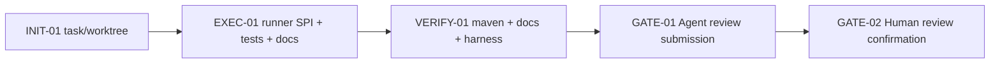

# Visual Map / 可视化图谱

Visual Map Contract: v1.0

## 图表索引（Map Index）

| ID | Type | Purpose | Required For Understanding | Source Evidence | Promotion Candidate |
| --- | --- | --- | --- | --- | --- |
| MAP-01 | phase | 展示本任务执行阶段和验证门禁 | yes | task_plan.md | no |
| MAP-02 | architecture | 展示 Remote Runner 与 Sandbox SPI 的边界 | yes | docs-site/docs/agent/remote-agent-runner-spi.md | yes |

## 阶段关系图（Phase Graph）



## 阶段表（Phase Table，表头供 checker 解析）

| Phase ID | Kind | Depends On | State | Completion | Output | Required Evidence | Exit Command | Actor | Evidence Status | Blocking Risk | Owner / Handoff |
| --- | --- | --- | --- | ---: | --- | --- | --- | --- | --- | --- | --- |
| INIT-01 | init | none | done | 100 | task/worktree created | `task_plan.md`; `execution_strategy.md`; worktree path | `harness task-start 2026-06-20-p5-remote-agent-runner-spi-contract-e311d42a` | agent | present | none | coordinator |
| EXEC-01 | execution | INIT-01 | in_progress | 70 | runner SPI, fake tests, docs-site page implemented | code diff; docs diff | `harness task-phase ... EXEC-01 --state done --completion 100 --evidence present` | agent | partial | verification pending | coordinator |
| VERIFY-01 | gate | EXEC-01 | planned | 0 | Maven/docs/Harness verification | commands in progress.md | n/a | agent | missing | tests pending | coordinator |
| GATE-01 | gate | VERIFY-01 | planned | 0 | Agent Review Submission | review.md; progress evidence; lesson routing | `harness task-review 2026-06-20-p5-remote-agent-runner-spi-contract-e311d42a --message "<summary>"` | agent | missing | none | coordinator |
| GATE-02 | gate | GATE-01 | planned | 0 | Human Review Confirmation | review packet and human confirmation | `harness review-confirm ...` | human | missing | Agent cannot self-confirm | human |

允许的 `State`：`planned`, `in_progress`, `review`, `blocked`, `done`, `skipped`。

## MAP-02 Remote Runner boundary

```text
Host-driven sandbox tools
  Java Agent loop runs in host process
  Shell/file/browser/project tools route to SandboxSession

Remote Agent Runner
  Host creates AgentRunnerSession
  Agent loop runs inside remote sandbox / hosted workspace
  Runner streams AgentRunnerEvent
  Runner returns AgentRunnerResult + artifacts
```
