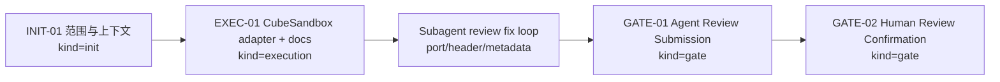
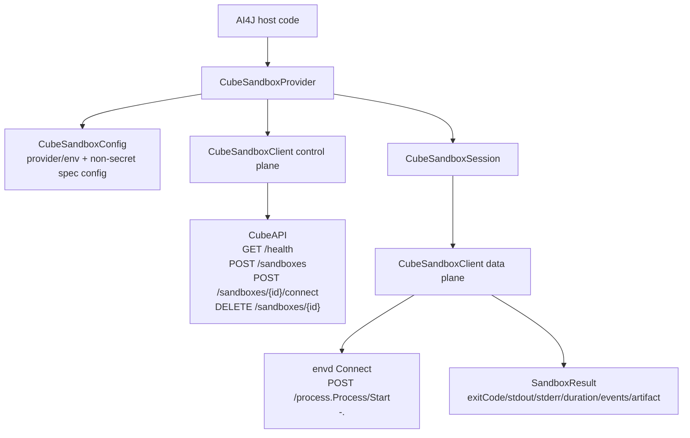
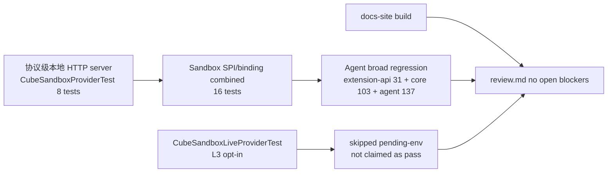

# Visual Map / 可视化图谱

Visual Map Contract: v1.0

本文件记录 CubeSandbox Provider 任务的阶段、协议结构和验证闭环，帮助后续 agent 快速理解当前 adapter 的边界。

## 图表索引（Map Index）

| ID | Type | Purpose | Required For Understanding | Source Evidence | Promotion Candidate |
| --- | --- | --- | --- | --- | --- |
| MAP-01 | phase | 展示任务生命周期阶段和门禁 | yes | `task_plan.md`, `progress.md` | no |
| MAP-02 | architecture | 展示 AI4J Sandbox SPI 到 CubeSandbox 控制面/数据面的映射 | yes | implementation diff, `findings.md` | no |
| MAP-03 | validation | 展示本地协议测试、broad regression、docs build、live opt-in residual 的关系 | yes | `walkthrough.md`, `review.md` | no |

## 阶段关系图（Phase Graph）

## 阶段表（Phase Table，表头供 checker 解析）

| Phase ID | Kind | Depends On | State | Completion | Output | Required Evidence | Exit Command | Actor | Evidence Status | Blocking Risk | Owner / Handoff |
| --- | --- | --- | --- | ---: | --- | --- | --- | --- | --- | --- | --- |
| INIT-01 | init | none | done | 100 | CubeSandbox provider scope, boundaries, official-source research, and task package established | `brief.md`; `task_plan.md`; `execution_strategy.md`; CubeSandbox OpenAPI/SDK references | `harness task-start 2026-06-21-cubesandbox-sandbox-provider-adapter-246de1fb` | agent | present | none | coordinator |
| EXEC-01 | execution | INIT-01 | done | 100 | Java 8 command-level CubeSandbox provider, tests, docs, and regression governance implemented | implementation diff; `CubeSandboxProviderTest`; docs-site page; Regression SSoT/Cadence update | `harness task-phase 2026-06-21-cubesandbox-sandbox-provider-adapter-246de1fb EXEC-01 --state done --completion 100 --evidence present` | agent | present | live CubeSandbox env absent, recorded as opt-in residual | coordinator |
| REVIEW-FIX | execution | EXEC-01 | done | 100 | Subagent blocking findings closed or mitigated: envdPort compatibility, raw header safety, ignored docs page staging, metadata/label filtering | `review.md` MF-001..MF-004; targeted 8-test regression | n/a | agent | present | none | coordinator + read-only reviewer `019ee672-860b-7593-9738-d3fd17d84b39` |
| GATE-01 | gate | REVIEW-FIX | done | 100 | Agent Review Submission created and materials repaired after scanner feedback | `review.md`; `walkthrough.md`; `lesson_candidates.md`; Harness status | `harness task-review 2026-06-21-cubesandbox-sandbox-provider-adapter-246de1fb --message "CubeSandbox sandbox provider adapter ready for review" .` | agent | present | none after material repair | coordinator |
| GATE-02 | gate | GATE-01 | planned | 0 | Human Review Confirmation | review packet and human confirmation | `harness review-confirm 2026-06-21-cubesandbox-sandbox-provider-adapter-246de1fb --confirm 2026-06-21-cubesandbox-sandbox-provider-adapter-246de1fb .` | human | missing | Agent cannot perform human confirmation | human |

允许的 `State`：`planned`, `in_progress`, `review`, `blocked`, `done`, `skipped`。

允许的 `Evidence Status`：`missing`, `partial`, `present`, `waived`。

允许的 `Kind`：`init`, `execution`, `gate`。

允许的 `Actor`：`agent`, `human`, `coordinator`。

`Completion` 使用 `0..100` 的整数；`done` 应为 `100`，`planned` 应为 `0`，`skipped` 不计入 dashboard 总完成度。dashboard 的实现完成度只由非 skipped 的 `execution` 阶段计算；`init` 和 `gate` 阶段表达生命周期门禁、下一步命令和责任人，不拉低实现完成度。

## 协议结构图（Architecture Map）

## 验证闭环图（Validation Map）

