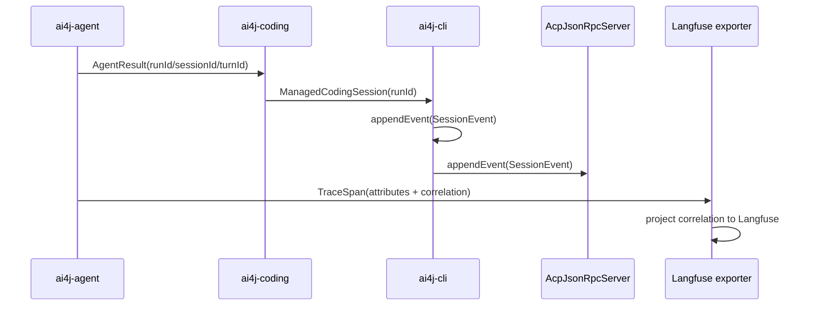

# Visual Map / 可视化图谱

Visual Map Contract: v1.0

## 图表索引（Map Index）

| ID | Type | Purpose | Required For Understanding | Source Evidence | Promotion Candidate |
| --- | --- | --- | --- | --- | --- |
| MAP-01 | sequence | 展示 observability 字段从 Agent 到 CLI/ACP 的传递 | yes | `task_plan.md` / `progress.md` | no |

## 序列图

## 状态表

| Phase ID | Kind | Depends On | State | Completion | Output | Required Evidence | Exit Command | Actor | Evidence Status | Blocking Risk | Owner / Handoff |
| --- | --- | --- | --- | ---: | --- | --- | --- | --- | --- | --- | --- | --- |
| INIT-01 | init | none | done | 100 | 任务计划和执行策略已确认 | `task_plan.md`; `execution_strategy.md` | `harness task-start 2026-06-22-agent-observability-enhancement-57c03f6b` | agent | present | none | coordinator |
| EXEC-01 | execution | INIT-01 | done | 100 | correlation 链路修复与真实测试通过 | diff、commands、review evidence | `harness task-phase 2026-06-22-agent-observability-enhancement-57c03f6b EXEC-01 --state done --completion 100 --evidence present` | agent | present | none | coordinator |
| GATE-01 | gate | EXEC-01 | done | 100 | Agent Review Submission | `review.md`、progress update、lesson routing | `harness task-review 2026-06-22-agent-observability-enhancement-57c03f6b --message "Agent observability enhancement ready for review"` | agent | present | none | coordinator |
| GATE-02 | gate | GATE-01 | planned | 0 | Human Review Confirmation | review packet 和人工确认 | `harness review-confirm 2026-06-22-agent-observability-enhancement-57c03f6b --confirm 2026-06-22-agent-observability-enhancement-57c03f6b` | human | missing | Agent 不能代办人工确认 | human |

## 支持性图表

- architecture：agent runtime -> coding session -> CLI/ACP session event -> trace exporter。
- data-flow：runId/sessionId/turnId/eventId 沿事件和投影链路前进。
- decision：不把 runId 持久化到 session store 元数据，先通过内存归一化和事件归一化收口。
