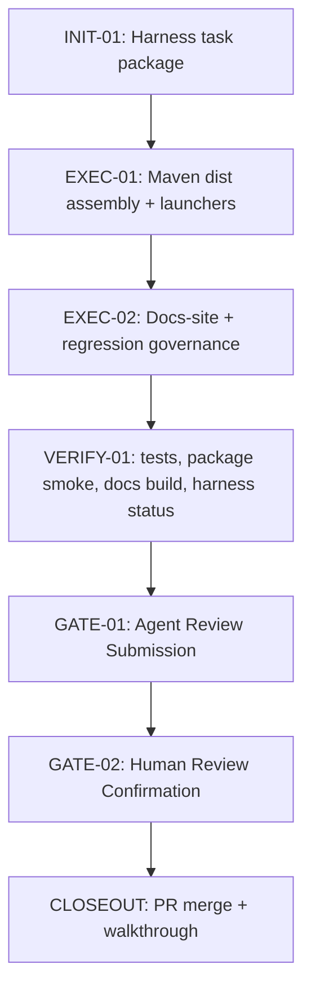

# Visual Map / 可视化图谱

Visual Map Contract: v1.0

本文件是任务图表集合，不只是阶段路线图。只有对人或 agent 理解任务有实际帮助的图才放进来。

## 图表索引（Map Index）

| ID | Type | Purpose | Required For Understanding | Source Evidence | Promotion Candidate |
| --- | --- | --- | --- | --- | --- |
| MAP-01 | phase | 展示本任务生命周期与发布门禁 | yes | `task_plan.md` | no |
| MAP-02 | surface-map | 展示 distribution package 的改动面和回归 gate | yes | `task_plan.md`; `review.md` | no |
| MAP-03 | packaging-flow | 展示 Maven filtering、fat jar 和 assembly 的打包顺序 | yes | `ai4j-cli/pom.xml`; `ai4j-cli/src/assembly/dist.xml` | no |

## 阶段关系图（Phase Graph）

## 阶段表（Phase Table，表头供 checker 解析）

| Phase ID | Kind | Depends On | State | Completion | Output | Required Evidence | Exit Command | Actor | Evidence Status | Blocking Risk | Owner / Handoff |
| --- | --- | --- | --- | ---: | --- | --- | --- | --- | --- | --- | --- |
| INIT-01 | init | none | done | 100 | task package 已创建并启动 | `task_plan.md`; `execution_strategy.md`; `progress.md` | `harness task-start 2026-06-20-cli-launcher-distribution-package-85f1c718` | agent | present | none | coordinator |
| EXEC-01 | execution | INIT-01 | in_progress | 90 | Maven dist assembly、launcher、测试、文档与治理更新 | diff; targeted test; package smoke; archive inspection; docs build | `harness task-phase 2026-06-20-cli-launcher-distribution-package-85f1c718 EXEC-01 --state done --completion 100 --evidence present` | agent | present | final diff/secret/harness gate pending | coordinator |
| GATE-01 | gate | EXEC-01 | planned | 0 | Agent Review Submission | `review.md`; progress update; lesson routing | `harness task-review 2026-06-20-cli-launcher-distribution-package-85f1c718 --message "CLI launcher distribution package ready for review"` | agent | missing | requires final verification | coordinator |
| GATE-02 | gate | GATE-01 | planned | 0 | Human Review Confirmation | review packet 和人工确认 | `harness review-confirm 2026-06-20-cli-launcher-distribution-package-85f1c718 --confirm 2026-06-20-cli-launcher-distribution-package-85f1c718` | human | missing | Agent 不能代办人工确认 | human |

允许的 `State`：`planned`, `in_progress`, `review`, `blocked`, `done`, `skipped`。

允许的 `Evidence Status`：`missing`, `partial`, `present`, `waived`。

允许的 `Kind`：`init`, `execution`, `gate`。

允许的 `Actor`：`agent`, `human`, `coordinator`。

`Completion` 使用 `0..100` 的整数；`done` 应为 `100`，`planned` 应为 `0`，`skipped` 不计入 dashboard 总完成度。dashboard 的实现完成度只由非 skipped 的 `execution` 阶段计算；`init` 和 `gate` 阶段表达生命周期门禁、下一步命令和责任人，不拉低实现完成度。

## 支持性图表（Supporting Maps）

### MAP-02：改动面

| Surface | Files | Purpose | Gate |
| --- | --- | --- | --- |
| Maven packaging | `ai4j-cli/pom.xml`, `ai4j-cli/src/assembly/dist.xml` | 生成 dist zip / tar.gz | RG-004 / RG-007 |
| Launcher templates | `ai4j-cli/src/main/dist/bin/ai4j`, `ai4j.cmd` | 稳定 `ai4j` 命令入口 | package smoke |
| Distribution examples | `ai4j-cli/src/main/dist/conf/*`, `README.md` | 无 secret 的配置起点 | layout test |
| Tests | `CliDistributionLayoutTest` | 锁定源布局和 secret-pattern | targeted test |
| Docs | `docs-site/docs/coding-agent/*` | 如实描述 install script / dist / fat jar | RG-008 |
| Governance | `docs/05-TEST-QA/*` | 更新固定回归证据 | Harness status |

### MAP-03：打包依赖顺序

1. `jar-with-dependencies` 先生成。
2. `maven-resources-plugin` 过滤 `src/main/dist` 到 `target/filtered-dist`。
3. `dist.xml` 从 `target/filtered-dist` 和 fat jar 组装 zip / tar.gz。
4. archive inspection 和 launcher smoke 验证产物。
5. docs-site 和治理文档记录真实产物边界。
