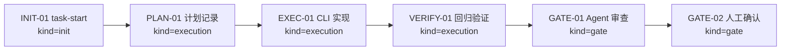
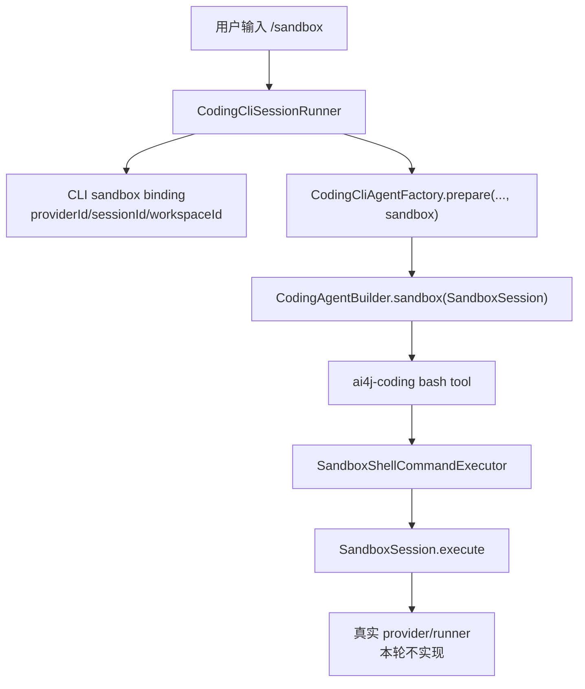
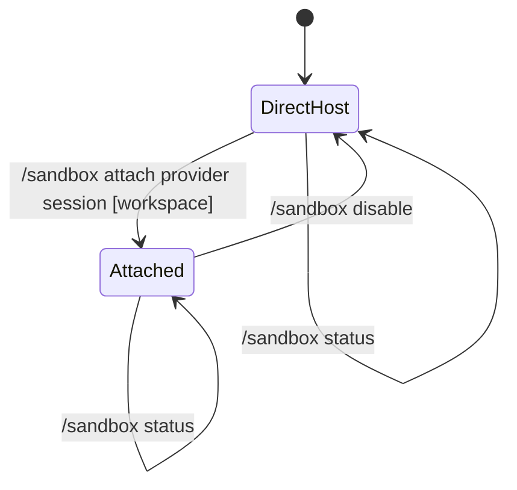

# Visual Map / 可视化图谱

Visual Map Contract: v1.0

本文件是任务图表集合，不只是阶段路线图。只有对人或 agent 理解任务有实际帮助的图才放进来。

## 图表索引（Map Index）

| ID | Type | Purpose | Required For Understanding | Source Evidence | Promotion Candidate |
| --- | --- | --- | --- | --- | --- |
| MAP-01 | phase | 展示执行阶段和依赖关系 | yes | `task_plan.md` | no |
| MAP-02 | architecture | 展示 CLI sandbox command 到 coding sandbox runtime 的边界 | yes | `references/cli-sandbox-command-plan.md` | no |
| MAP-03 | state | 展示 direct-host / attached / disabled 状态转换 | yes | `references/cli-sandbox-command-plan.md` | no |

## 阶段关系图（Phase Graph）

## 架构图（Command to Runtime Boundary）

## 状态图（Sandbox CLI State）

## 阶段表（Phase Table，表头供 checker 解析）

| Phase ID | Kind | Depends On | State | Completion | Output | Required Evidence | Exit Command | Actor | Evidence Status | Blocking Risk | Owner / Handoff |
| --- | --- | --- | --- | ---: | --- | --- | --- | --- | --- | --- | --- |
| INIT-01 | init | none | done | 100 | worktree 和 task-start 已完成 | `git worktree list`; `progress.md` task-start | `harness task-start MODULES/cli-host/2026-06-20-p4-cli-sandbox-commands-72f40aa0` | agent | present | none | coordinator |
| PLAN-01 | execution | INIT-01 | done | 100 | P4 CLI sandbox command 计划、边界和证据矩阵已记录 | `task_plan.md`; `execution_strategy.md`; `references/cli-sandbox-command-plan.md`; `findings.md` | n/a | agent | present | none | coordinator |
| EXEC-01 | execution | PLAN-01 | done | 100 | CLI state、slash dispatch、runtime rebind、completion/palette/help/status 和 docs 更新完成 | diff、tests、docs | `harness task-phase MODULES/cli-host/2026-06-20-p4-cli-sandbox-commands-72f40aa0 EXEC-01 --state done --completion 100 --evidence present` | agent | present | none | coordinator |
| VERIFY-01 | execution | EXEC-01 | done | 100 | targeted/broad CLI tests、docs build、diff hygiene 和 Harness status 已通过 | Maven、docs-site、diff、harness status | `git diff --check`; `npx --yes coding-agent-harness status --json .` | agent | present | clean commit pending before lifecycle review | coordinator |
| GATE-01 | gate | VERIFY-01 | done | 100 | Agent Review Submission | `review.md`、progress update、lesson routing | `harness task-review MODULES/cli-host/2026-06-20-p4-cli-sandbox-commands-72f40aa0 --message "
" .` | agent | present | requires clean tree or lifecycle-owned commit boundary | coordinator |
| GATE-02 | gate | GATE-01 | planned | 0 | PR、CI、人工确认和 merge | GitHub PR checks and human review confirmation | dashboard workbench confirmation / PR review | human | missing | Agent 不能代办人工确认 | human / coordinator |

允许的 `State`：`planned`, `in_progress`, `review`, `blocked`, `done`, `skipped`。
允许的 `Evidence Status`：`missing`, `partial`, `present`, `waived`。
允许的 `Kind`：`init`, `execution`, `gate`。
允许的 `Actor`：`agent`, `human`, `coordinator`。

`Completion` 使用 `0..100` 的整数；`done` 应为 `100`，`planned` 应为 `0`，`skipped` 不计入 dashboard 总完成度。dashboard 的实现完成度只由非 skipped 的 `execution` 阶段计算；`init` 和 `gate` 阶段表达生命周期门禁、下一步命令和责任人，不拉低实现完成度。
