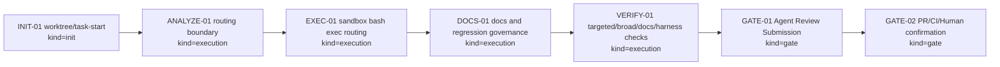
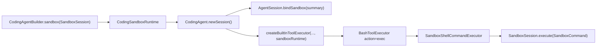
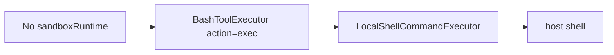

# Visual Map / 可视化图谱

Visual Map Contract: v1.0

本文件记录 P3 Coding sandbox tool routing 首切片的阶段、路由图和明确未路由面。

## 图表索引（Map Index）

| ID | Type | Purpose | Required For Understanding | Source Evidence | Promotion Candidate |
| --- | --- | --- | --- | --- | --- |
| MAP-01 | phase | 展示本任务 lifecycle、证据和下一步门禁 | yes | `task_plan.md`; `progress.md` | no |
| MAP-02 | data-flow | 展示 `bash action=exec` 进入 sandbox 的运行链路 | yes | code diff / tests | no |
| MAP-03 | scope | 展示本切片未路由的工具面 | yes | `findings.md`; docs-site | no |

## 阶段关系图（Phase Graph）

## 阶段表（Phase Table，表头供 checker 解析）

| Phase ID | Kind | Depends On | State | Completion | Output | Required Evidence | Exit Command | Actor | Evidence Status | Blocking Risk | Owner / Handoff |
| --- | --- | --- | --- | ---: | --- | --- | --- | --- | --- | --- | --- |
| INIT-01 | init | none | done | 100 | worktree 和 module task 已创建并 task-start | `git worktree list`; `progress.md` task-start | `harness task-start MODULES/coding-runtime/2026-06-20-p3-coding-sandbox-tool-routing-6c82c346` | agent | present | none | coordinator |
| ANALYZE-01 | execution | INIT-01 | done | 100 | 已确认首切片只覆盖 foreground `bash action=exec` | `findings.md`; `execution_strategy.md` | n/a | agent | present | none | coordinator |
| EXEC-01 | execution | ANALYZE-01 | done | 100 | sandbox runtime handle、shell executor、builder/session wiring 和 tests 已实现 | `ai4j-coding/src/main/java`; `ai4j-coding/src/test/java` | n/a | agent | present | clean commit / lifecycle review pending | coordinator |
| DOCS-01 | execution | EXEC-01 | done | 100 | docs-site 页面、roadmap/sidebar、Regression SSoT/Cadence Ledger 已更新 | `docs-site/docs/coding-agent/sandbox-routing.md`; `docs/05-TEST-QA/` | n/a | agent | present | clean commit / lifecycle review pending | coordinator |
| VERIFY-01 | execution | DOCS-01 | done | 100 | targeted/broad coding tests、docs build 和 diff hygiene 已通过；harness status 0 failures，等待 clean commit 后 lifecycle 推进 | Maven targeted; Maven broad; docs build; `git diff --check`; harness status 0 failures | `git diff --check`; `npx --yes coding-agent-harness status --json .` | agent | present | harness lifecycle state still in_progress before task-review | coordinator |
| GATE-01 | gate | VERIFY-01 | planned | 0 | Agent Review Submission | `review.md`; final progress evidence; lesson routing | `harness task-review MODULES/coding-runtime/2026-06-20-p3-coding-sandbox-tool-routing-6c82c346 --message "
" .` | agent | partial | requires clean tree or lifecycle-owned commit boundary | coordinator |
| GATE-02 | gate | GATE-01 | planned | 0 | PR、CI、人工确认和 merge | GitHub PR checks and human review confirmation | `gh pr create`; `gh pr checks --watch`; merge after approval | human | missing | remote CI or review may fail | human / coordinator |

允许的 `State`：`planned`, `in_progress`, `review`, `blocked`, `done`, `skipped`。
允许的 `Evidence Status`：`missing`, `partial`, `present`, `waived`。
允许的 `Kind`：`init`, `execution`, `gate`。
允许的 `Actor`：`agent`, `human`, `coordinator`。
`Completion` 使用 `0..100` 的整数；`done` 应为 `100`，`planned` 应为 `0`，`skipped` 不计入 dashboard 总完成度。

## 支持性图表（Supporting Maps）

### MAP-02：Sandbox bash exec routing

### MAP-03：Local fallback and non-routed surfaces

| Surface | State | Follow-up |
| --- | --- | --- |
| read_file | local | future sandbox file service |
| write_file | local | future sandbox file service |
| apply_patch | local | future sandbox patch application |
| bash background processes | local | provider process lifecycle task |
| browser / screenshot | not implemented | future sandbox browser provider |
| CLI /sandbox | not implemented | P4 CLI sandbox commands |
