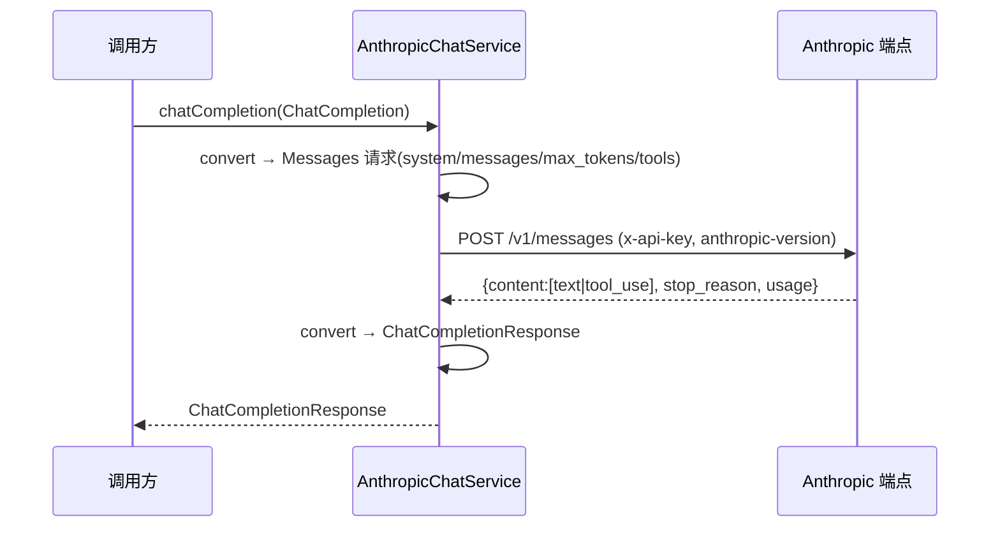

# Visual Map / 可视化图谱

Visual Map Contract: v1.0

## 图表索引（Map Index）

| ID | Type | Purpose | Required For Understanding | Source Evidence | Promotion Candidate |
| --- | --- | --- | --- | --- | --- |
| MAP-01 | architecture | 展示新增 Anthropic 适配器在 SDK provider 层的位置与双格式收敛 | yes | `task_plan.md` / `findings.md` | no |
| MAP-02 | sequence | 展示 Anthropic Messages 请求/响应/流映射链路 | yes | `task_plan.md` | no |

## 架构图（MAP-01）

```mermaid
graph LR
  subgraph 统一接口
    ICS[IChatService]
  end
  subgraph OpenAI 格式适配器（已有 12 家）
    OAI[openai]
    ZHIPU[zhipu paas/v4]
    MINIOLD[minimax old]
    OTHERS[deepseek/moonshot/...]
  end
  subgraph Anthropic 格式适配器（本任务新增）
    ANTH[anthropic]
  end
  ANTH -->|api.anthropic.com| CLAUDE[Claude]
  ANTH -->|open.bigmodel.cn/api/anthropic| GLM[智谱 Coding Plan]
  ANTH -->|api.minimaxi.com anthropic 入口| M3[Minimax-M3]
  OAI --> ICS
  ZHIPU --> ICS
  MINIOLD --> ICS
  OTHERS --> ICS
  ANTH --> ICS
```

## 序列图（MAP-02）



## 状态表

| Phase ID | Kind | Depends On | State | Completion | Output | Required Evidence | Actor | Evidence Status | Blocking Risk | Owner / Handoff |
| --- | --- | --- | --- | ---: | --- | --- | --- | --- | --- | --- |
| INIT-01 | init | none | done | 100 | 任务计划/执行策略/visual_map 已就位 | `task_plan.md`; `execution_strategy.md`; `visual_map.md`; `findings.md` | coordinator | present | none | coordinator |
| EXEC-01 | execution | INIT-01 | done | 100 | `platform/anthropic/` 全套 + PlatformType/Configuration/工厂注册 | diff、`AnthropicChatService` | coordinator | present | none | coordinator |
| EXEC-02 | execution | EXEC-01 | done | 100 | chat/stream/tool_use 映射 + 13 单测 | `AnthropicChatServiceTest` 13 tests | coordinator | present | none | coordinator |
| GATE-01 | gate | EXEC-02 | done | 100 | live 烟测 + ai4j 116 回归 + 下游编译 | `progress.md` | coordinator | present | none | coordinator |
| GATE-02 | gate | GATE-01 | review | 100 | Agent Review Submission | `review.md`、walkthrough | coordinator | present | 人工确认 | human |

## 支持性图表

- architecture：provider 层双格式收敛（OpenAI 格式 × N 家 + Anthropic 格式 × 可配 baseUrl）。
