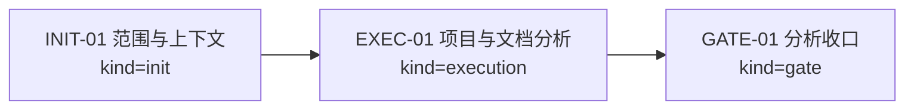
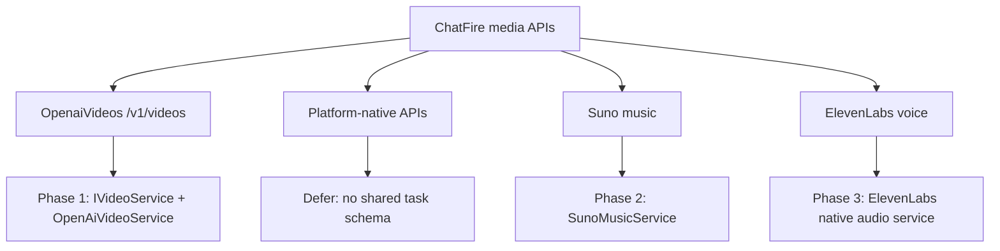

# Visual Map / 可视化图谱

Visual Map Contract: v1.0

## 图表索引（Map Index）

| ID | Type | Purpose | Required For Understanding | Source Evidence | Promotion Candidate |
| --- | --- | --- | --- | --- | --- |
| MAP-01 | phase | 展示分析任务执行阶段和依赖关系 | yes | `task_plan.md` | no |
| MAP-02 | decision | 展示统一格式优先、原生格式后置的方案选择 | yes | `references/chatfire-media-integration-analysis.md` | no |

## 阶段关系图（Phase Graph）

## 决策图（Decision Map）

## 阶段表（Phase Table，表头供 checker 解析）

| Phase ID | Kind | Depends On | State | Completion | Output | Required Evidence | Exit Command | Actor | Evidence Status | Blocking Risk | Owner / Handoff |
| --- | --- | --- | --- | ---: | --- | --- | --- | --- | --- | --- | --- |
| INIT-01 | init | none | done | 100 | 任务边界已清楚到可以执行 | `task_plan.md` | `harness task-start 2026-07-03-chatfire-media-generation-integration-analysis-3697f321` | agent | present | none | coordinator |
| EXEC-01 | execution | INIT-01 | done | 100 | ChatFire API 与项目服务边界分析已完成 | `references/chatfire-media-integration-analysis.md` | n/a | agent | present | none | coordinator |
| GATE-01 | gate | EXEC-01 | done | 100 | 分析任务完成，无生产代码变更 | `progress.md`, `walkthrough.md` | `harness task-complete 2026-07-03-chatfire-media-generation-integration-analysis-3697f321` | agent | present | none | coordinator |

允许的 `State`：`planned`, `in_progress`, `review`, `blocked`, `done`, `skipped`。

允许的 `Evidence Status`：`missing`, `partial`, `present`, `waived`。

允许的 `Kind`：`init`, `execution`, `gate`。

允许的 `Actor`：`agent`, `human`, `coordinator`。

`Completion` 使用 `0..100` 的整数；`done` 应为 `100`，`planned` 应为 `0`，`skipped` 不计入 dashboard 总完成度。
