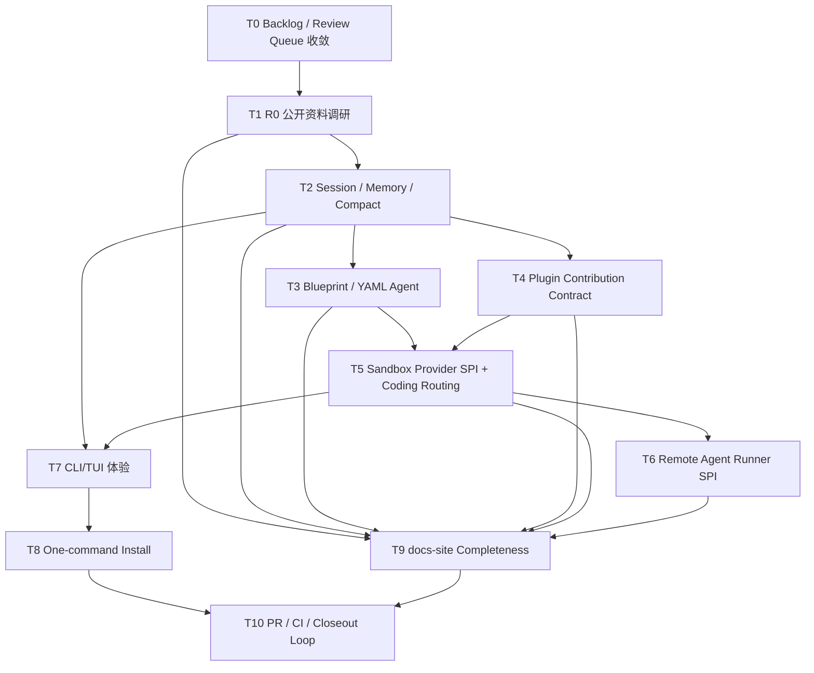

# AI4J Agent SDK 任务拆解与执行路线

> 记录日期：2026-06-21  
> Harness 任务：`MODULES/docs-site/2026-06-21-agent-sdk-task-decomposition-and-technical-docs-5ac6fa9e`  
> 基线：`origin/dev` at `92f8f3a`  
> 性质：任务拆解与技术文档入口；不代表所有代码都已完成。

## 1. 总目标

把 AI4J 从“已有 Java AI SDK / Agent 能力集合”继续推进成三层可交付产品：

1. **Java Agent SDK**：低成本接入模型、工具、RAG、Memory、Compact、Workflow、插件、权限和沙箱抽象。
2. **可组装 Agent 底座**：YAML Blueprint、插件贡献点、Sandbox Provider、Remote Agent Runner SPI 让第三方和业务方能扩展。
3. **Coding Agent CLI/TUI**：用户安装后输入 `ai4j`，进入类似 Codex / Claude Code / OpenCode / Pi 的终端交互体验。

## 2. 执行前提

- 所有实现切片必须从最新 `origin/dev` 创建 dedicated worktree。
- 已经存在 review/handoff 的任务不要重复实现；先按当前代码、PR、Harness 状态判断。
- provider token、sandbox secret、cookie、个人路径不能进入源码、测试、docs、progress 或 PR 描述。
- docs-site 示例只能使用真实 API / 真实 CLI / 真实测试入口。
- 新增固定回归面时同步 `docs/05-TEST-QA/Regression-SSoT.md` 和 `docs/05-TEST-QA/Cadence-Ledger.md`。

## 3. 当前状态总览

当前 `origin/dev` 已经包含 Agent SDK 基座、Blueprint、Sandbox SPI、Coding sandbox routing、CLI sandbox command、Remote Runner SPI、R0 research digest 和 TUI status bar。Harness 上很多任务处于 `review`，这表示 **等待人工确认/closeout**，不等于代码缺失。

| 领域 | 当前事实 | 下一步 |
| --- | --- | --- |
| R0 调研 | 已有 source-backed research digest 与 docs-site 页面 | 后续设计引用 digest，不再凭印象对标 Pi/Codex/Claude/OpenCode。 |
| Session/Memory/Compact | `AgentSession`、context projector、compact report、session API polish 已有任务 | 继续做 CLI 可诊断体验和 API 文档精修。 |
| Blueprint | YAML loader、validator、AgentFactory、schema export 与 CLI run 已有任务 | 后续做 schema 兼容、示例校验和 FlowGram/模板桥接。 |
| Plugin | lifecycle hook、contribution metadata、guardrail/tool/resource 方向已有任务 | 后续做第三方插件作者体验和 sandbox/runner provider 插件。 |
| Sandbox | Sandbox SPI、session binding、coding shell routing、CLI attach/status/disable 已有任务 | 后续扩展 file/browser/project tool routing 和真实 provider 示例。 |
| Remote Runner | SPI contract 已存在 | 后续做 fake runner 场景、事件流、checkpoint/artifact 示例。 |
| CLI/TUI | provider/model/session/status bar、sandbox、memory/compact、permissions 等任务已拆分 | 后续做交互 polish、tmux smoke、分发安装。 |
| docs-site | 已有 real API matrix、R0 digest、本页任务拆解 | 后续按能力页逐页补真实示例、边界、排障。 |

## 4. 任务队列

### T0：Backlog / Review Queue 收敛

| 字段 | 内容 |
| --- | --- |
| 主模块 | Harness / affected modules |
| 现有任务 | `agent-runtime-backlog-reconciliation-after-runne-d9f9832a` |
| 输出 | 区分 `merged-on-dev`、`review-confirmation-pending`、`needs-closeout`、`superseded`、`true-open-gap`。 |
| 不做 | 不把 review 状态误判为实现缺失；不重复实现已合并代码。 |
| 验证 | `npx --yes coding-agent-harness status --json .`、`gh pr list/view`、源码路径检查。 |
| 优先级 | 最高。每轮实现前都要执行。 |

### T1：R0 Source-backed Research Digest

| 字段 | 内容 |
| --- | --- |
| 主模块 | `docs-site` |
| 现有任务 | `agent-sdk-r0-source-backed-research-digest-c11603e7` |
| 输出 | Pi、Codex、Claude Code、OpenCode、Spring AI、LangChain4j、AgentScope Java、E2B/Daytona/Modal/CubeSandbox digest。 |
| 不做 | 不复制泄露源码；不把未验证内部实现写成事实。 |
| 验证 | `npm --prefix docs-site run build`、source links、Harness status。 |
| 状态 | 已有页面和任务包，后续只增量补 source gap。 |

### T2：Session / Memory / Compact 收口

| 字段 | 内容 |
| --- | --- |
| 主模块 | `ai4j-agent` + `ai4j-cli` |
| 现有任务 | `memory-compact-session-api-polish-53845a17`、`cli-memory-compact-command-ux-d56c15fd` |
| 输出 | 稳定 `AgentSession.compact(...)` / report API、CLI `/memory` `/compact` `/compacts`、docs-site 示例。 |
| 不做 | 不把 compact 做成不可解释的纯自然语言摘要；不保存 secret。 |
| 验证 | `mvn -pl ai4j-agent -am "-Dtest=*Memory*,*Compact*,*Session*" -DskipTests=false -DfailIfNoTests=false test`; `mvn -pl ai4j-cli -am "-Dtest=*Memory*,*Compact*,SlashCommandControllerTest" -DskipTests=false -DfailIfNoTests=false test`; docs build。 |
| 下一步 | 优先做 CLI 体验和文档示例，不重复 Agent 基座。 |

### T3：Blueprint / YAML Agent Hardening

| 字段 | 内容 |
| --- | --- |
| 主模块 | `ai4j-agent` + `ai4j-cli` + `docs-site` |
| 现有任务 | `agent-blueprint-schema-export-and-docs-hardening-4741edc1`、P1-A/P1-B/P1-C 任务 |
| 输出 | schema export、兼容 fixture、错误提示、`ai4j-cli blueprint schema`、`ai4j-cli run <agent.yaml>` 示例。 |
| 不做 | 不支持任意 Java 代码执行；不把 token 写进 YAML。 |
| 验证 | Blueprint loader/validator/factory tests、CLI run command tests、docs build。 |
| 下一步 | 对 docs-site 的 YAML 示例做源码/fixture 校验。 |

### T4：Plugin Contribution Contract 与第三方插件生态

| 字段 | 内容 |
| --- | --- |
| 主模块 | `ai4j-extension-api` + `ai4j-agent` + `ai4j-cli` |
| 现有任务 | `plugin-contribution-contract-expansion-e2b3bcae`、历史 extension wave tasks |
| 输出 | Tool、Command、Prompt、Skill、Lifecycle Hook、Guardrail、Memory、Sandbox Provider、Runner Provider、CLI Command 贡献点表述清楚。 |
| 不做 | 安装插件不自动暴露危险工具；首版不开放任意 TUI render plugin。 |
| 验证 | extension-api tests、agent plugin tests、CLI extension inspect/run tests、docs build。 |
| 下一步 | 写“第三方插件作者任务包”和官方示例插件增强。 |

### T5：Sandbox Provider SPI 与 Coding Tool Routing

| 字段 | 内容 |
| --- | --- |
| 主模块 | `ai4j-agent` + `ai4j-coding` + `ai4j-cli` |
| 现有任务 | P2-A、P2-B、P3、P4 任务 |
| 输出 | `SandboxProvider` / `SandboxSession` 合同、session binding、shell/file/browser/project tool routing、CLI `/sandbox` UX。 |
| 不做 | 不默认内置真实云沙箱；metadata-only attach 不能静默回退宿主执行。 |
| 验证 | `mvn -pl ai4j-agent -am "-Dtest=*Sandbox*" -DskipTests=false -DfailIfNoTests=false test`; `mvn -pl ai4j-coding -am "-Dtest=*Sandbox*,BashToolExecutorTest,CodingAgentBuilderTest" -DskipTests=false -DfailIfNoTests=false test`; CLI sandbox tests。 |
| 下一步 | 从 shell routing 扩展到 file/browser/project run，并补 fake provider fixtures。 |

### T6：Remote Agent Runner SPI

| 字段 | 内容 |
| --- | --- |
| 主模块 | `ai4j-agent` |
| 现有任务 | `p5-remote-agent-runner-spi-contract-e311d42a` |
| 输出 | `AgentRunnerProvider`、`AgentRunnerSession`、`AgentRunnerSpec`、事件流、artifact、checkpoint/cancel 合同。 |
| 不做 | 不把 AI4J 变成云控制平台；不直接绑定某个 provider。 |
| 验证 | fake runner contract tests、event stream tests、docs build。 |
| 下一步 | 做 cloud-agent product guide 和 runner fixture cookbook。 |

### T7：Coding Agent CLI/TUI 体验

| 字段 | 内容 |
| --- | --- |
| 主模块 | `ai4j-cli` |
| 现有任务 | `cli-tui-status-context-bar-e2d583b1`、`cli-permissions-command-ux-7bbbc71d`、`cli-memory-compact-command-ux-d56c15fd`、`p4-cli-sandbox-commands-72f40aa0` |
| 输出 | provider/model/session/memory/compact/plugin/sandbox/permissions 状态一眼可见；slash command 可发现；markdown/code/diff/tool/approval/error 分块渲染。 |
| 不做 | 不切换到 Ink/Node 主栈；不自研完整 terminal renderer。 |
| 验证 | CLI targeted tests；必要时 tmux smoke 驱动 `ai4j` 交互。 |
| 下一步 | 增加 tmux smoke script/task，验证真实终端交互而非只测 parser。 |

### T8：One-command Install / Launcher Distribution

| 字段 | 内容 |
| --- | --- |
| 主模块 | `ai4j-cli` |
| 现有任务 | `cli-launcher-distribution-package-85f1c718` |
| 输出 | 选型 ADR：zip+scripts / JBang / npm wrapper / native-image / Scoop/Homebrew/Sdkman；最小可验证 launcher。 |
| 不做 | 不为了体验牺牲 Java 8 模块兼容；不把 provider key 放进安装脚本。 |
| 验证 | packaging smoke、`ai4j --help`、`ai4j` interactive smoke、Windows path check。 |
| 下一步 | 先完成 ADR 和 Windows 本地 smoke，再考虑正式发布通道。 |

### T9：docs-site Completeness Pass

| 字段 | 内容 |
| --- | --- |
| 主模块 | `docs-site` |
| 现有任务 | `docs-site-agent-sdk-real-api-completeness-pass-d9906610` + 本任务 |
| 输出 | 每个能力页都讲清楚“问题、适用/不适用、真实示例、API 字段、边界、排障、源码/测试入口”。 |
| 不做 | 不写不存在 API；不写“企业采用”式生硬措辞；不把 roadmap 当教程。 |
| 验证 | `npm --prefix docs-site run build`、真实 API matrix 对照、fake API scan。 |
| 下一步 | 按页面分批修：Session/Memory、Blueprint、Plugin、Sandbox/Runner、CLI/TUI。 |

### T10：Release / PR / CI / Closeout Loop

| 字段 | 内容 |
| --- | --- |
| 主模块 | Harness + affected module |
| 输出 | 每个实现切片 PR 绿色后合并，删除远程分支和本地 worktree，回写 progress/review/walkthrough。 |
| 不做 | 不把本地 commit 当作完成；不跳过 GitHub checks；不把 review-confirm 和 task-complete 混为一谈。 |
| 验证 | `gh pr checks --watch`、merge commit、`harness status --json .`。 |
| 下一步 | 本任务 PR 绿色后合并，并继续队列中的第一个未完成实现切片。 |

## 5. 依赖顺序

## 6. 每个实现任务的固定门禁

1. 从最新 `origin/dev` 创建 worktree，分支按 `feature/`、`fix/`、`docs/`、`refactor/`、`test/`。
2. 创建或复用 Harness task package，并用 `task-start`、`task-log`、`task-review` 推进。
3. 实现只改任务允许的模块边界；跨模块必须在 task plan 中列明。
4. Java 代码保持 Java 8 兼容。
5. CLI/TUI 改动至少覆盖 parser、view model、runtime dispatch、ACP 或 docs 一致性之一。
6. docs-site 改动运行 `npm --prefix docs-site run build`。
7. Maven 命令在 PowerShell 中 quote 完整 `-Dtest=...`，使用 `-DfailIfNoTests=false` 配合 `-am`。
8. token fragment scan 必须无命中，尤其是 provider key、sandbox secret、cookie、个人路径。
9. PR 绿色后再 merge；merge 后清理 worktree/branch；回写 walkthrough。

## 7. 推荐下一步

如果只选一个下一步，优先顺序是：

1. **CLI `/memory` + `/compact` UX**：最直接提升 coding agent 使用体验，也能验证 Session/Compact 设计是否真的好用。
2. **One-command install ADR/prototype**：让用户可以通过 `ai4j` 进入交互式体验。
3. **docs-site capability completeness**：把已经实现的能力讲清楚，减少小白用户学习成本。
4. **tmux CLI smoke task**：用真实终端行为验证 TUI，而不只依赖单元测试。

## 8. 状态口径

- `review`：Agent 已提交审查，等待人工确认或 closeout；不是失败。
- `merged-on-dev`：代码已在 `dev`，但 Harness 任务可能仍待确认。
- `metadata-only attach`：只记录 sandbox binding，不能代表真实 sandbox tool routing 已可用。
- `SPI / contract`：合同存在，真实 provider 由业务方或插件实现。
- `docs page exists`：文档入口存在，不代表能力完成度等于 100%。
