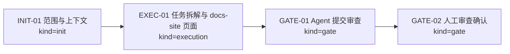
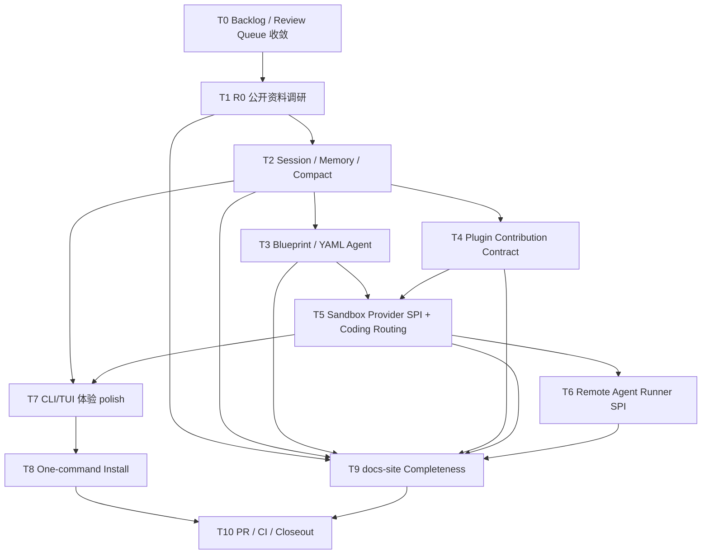

# Visual Map / 可视化图谱

Visual Map Contract: v1.0

## 图表索引（Map Index）

| ID | Type | Purpose | Required For Understanding | Source Evidence | Promotion Candidate |
| --- | --- | --- | --- | --- | --- |
| MAP-01 | phase | 展示本任务执行阶段 | yes | `task_plan.md` | no |
| MAP-02 | dependency | 展示 Agent SDK 后续任务依赖 | yes | `references/agent-sdk-task-decomposition-2026-06-21.md` | no |

## 阶段关系图（Phase Graph）

## 后续任务依赖图

## 阶段表（Phase Table，表头供 checker 解析）

| Phase ID | Kind | Depends On | State | Completion | Output | Required Evidence | Exit Command | Actor | Evidence Status | Blocking Risk | Owner / Handoff |
| --- | --- | --- | --- | ---: | --- | --- | --- | --- | --- | --- | --- |
| INIT-01 | init | none | done | 100 | task package created and started | `task_plan.md`; `execution_strategy.md`; `task-start` output | `harness task-start 2026-06-21-agent-sdk-task-decomposition-and-technical-docs-5ac6fa9e` | agent | present | none | coordinator |
| EXEC-01 | execution | INIT-01 | done | 100 | task decomposition reference and docs-site page written | `references/agent-sdk-task-decomposition-2026-06-21.md`; `docs-site/docs/agent/sdk-task-decomposition.md`; sidebar/overview/roadmap links | `harness task-phase ... EXEC-01 --state done --completion 100 --evidence present` | agent | present | verification pending | coordinator |
| GATE-01 | gate | EXEC-01 | planned | 0 | Agent Review Submission | `review.md`; progress update; validation commands | `harness task-review 2026-06-21-agent-sdk-task-decomposition-and-technical-docs-5ac6fa9e --message "
"` | agent | missing | must pass checks | coordinator |
| GATE-02 | gate | GATE-01 | planned | 0 | Human Review Confirmation | review packet 和人工确认 | `harness review-confirm 2026-06-21-agent-sdk-task-decomposition-and-technical-docs-5ac6fa9e --confirm 2026-06-21-agent-sdk-task-decomposition-and-technical-docs-5ac6fa9e` | human | missing | Agent 不能代办人工确认 | human |

允许的 `State`：`planned`, `in_progress`, `review`, `blocked`, `done`, `skipped`。
允许的 `Evidence Status`：`missing`, `partial`, `present`, `waived`。
允许的 `Kind`：`init`, `execution`, `gate`。
允许的 `Actor`：`agent`, `human`, `coordinator`。
