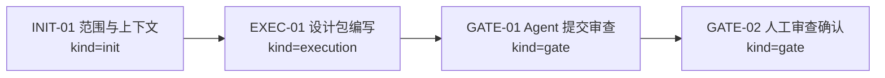
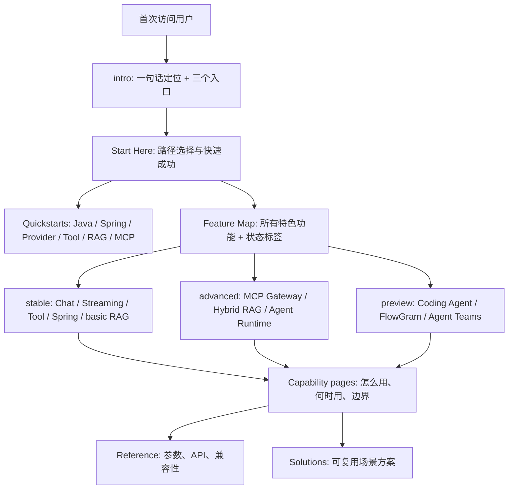

# Visual Map / 可视化图谱

Visual Map Contract: v1.0

## 图表索引（Map Index）

| ID | Type | Purpose | Required For Understanding | Source Evidence | Promotion Candidate |
| --- | --- | --- | --- | --- | --- |
| MAP-01 | phase | 展示执行阶段和依赖关系 | yes | `task_plan.md` | no |
| MAP-02 | decision | 展示 docs-site 分层承载策略 | yes | `references/docs-site-redesign-design.md` | no |

## 阶段关系图（Phase Graph）

## 阶段表（Phase Table，表头供 checker 解析）

| Phase ID | Kind | Depends On | State | Completion | Output | Required Evidence | Exit Command | Actor | Evidence Status | Blocking Risk | Owner / Handoff |
| --- | --- | --- | --- | ---: | --- | --- | --- | --- | --- | --- | --- |
| INIT-01 | init | none | done | 100 | 任务计划和执行策略已确认 | `task_plan.md`; `execution_strategy.md` | `harness task-start 2026-06-04-docs-site-information-architecture-redesign-6c91ba27` | agent | present | none | coordinator |
| EXEC-01 | execution | INIT-01 | done | 100 | docs-site 当前盘点、目标 IA、页面合同和迁移波次已完成 | `references/*.md`; `progress.md`; `artifacts/INDEX.md` | `harness task-phase 2026-06-04-docs-site-information-architecture-redesign-6c91ba27 EXEC-01 --state done --completion 100 --evidence present` | agent | present | implementation requires separate approval | coordinator |
| GATE-01 | gate | EXEC-01 | planned | 0 | Agent Review Submission | `review.md`、progress update、lesson routing | `harness task-review 2026-06-04-docs-site-information-architecture-redesign-6c91ba27 --message "
"` | agent | present | none | coordinator |
| GATE-02 | gate | GATE-01 | planned | 0 | Human Review Confirmation | review packet 和人工确认 | dashboard workbench confirmation | human | missing | Agent 不能代办人工确认 | human |

## docs-site 分层策略

