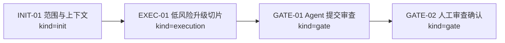

# Visual Map / 可视化图谱

Visual Map Contract: v1.0

本任务的图表用于说明第一波升级切片的生命周期、证据依赖和后续人工确认边界。

## 图表索引（Map Index）

| ID | Type | Purpose | Required For Understanding | Source Evidence | Promotion Candidate |
| --- | --- | --- | --- | --- | --- |
| MAP-01 | phase | 展示执行阶段和依赖关系 | yes | `task_plan.md`; `progress.md`; `review.md` | no |

## 阶段关系图（Phase Graph）

## 阶段表（Phase Table，表头供 checker 解析）

| Phase ID | Kind | Depends On | State | Completion | Output | Required Evidence | Exit Command | Actor | Evidence Status | Blocking Risk | Owner / Handoff |
| --- | --- | --- | --- | ---: | --- | --- | --- | --- | --- | --- | --- |
| INIT-01 | init | none | done | 100 | 任务计划和执行策略已确认 | `task_plan.md`; `execution_strategy.md` | `harness task-start 2026-06-04-first-wave-project-upgrades-93da333c` | agent | present | none | coordinator |
| EXEC-01 | execution | INIT-01 | done | 100 | 移除本机 GPG 绝对路径，忽略本地 output，完成 Maven package 验证 | diff; `progress.md`; `artifacts/INDEX.md` | `harness task-phase 2026-06-04-first-wave-project-upgrades-93da333c EXEC-01 --state done --completion 100 --evidence present` | agent | present | release signing 未做真实发布验证 | coordinator |
| GATE-01 | gate | EXEC-01 | done | 100 | Agent Review Submission 已生成 | `review.md`; `progress.md`; `lesson_candidates.md` | `harness task-review 2026-06-04-first-wave-project-upgrades-93da333c --message "
"` | agent | present | none | coordinator |
| GATE-02 | gate | GATE-01 | planned | 0 | Human Review Confirmation 等待用户 | review packet 和人工确认 | `harness review-confirm 2026-06-04-first-wave-project-upgrades-93da333c --confirm 2026-06-04-first-wave-project-upgrades-93da333c` | human | missing | Agent 不能代办人工确认 | human |

允许的 `State`：`planned`, `in_progress`, `review`, `blocked`, `done`, `skipped`。

允许的 `Evidence Status`：`missing`, `partial`, `present`, `waived`。

允许的 `Kind`：`init`, `execution`, `gate`。

允许的 `Actor`：`agent`, `human`, `coordinator`。

`Completion` 使用 `0..100` 的整数；`done` 应为 `100`，`planned` 应为 `0`，`skipped` 不计入 dashboard 总完成度。dashboard 的实现完成度只由非 skipped 的 `execution` 阶段计算；`init` 和 `gate` 阶段表达生命周期门禁、下一步命令和责任人，不拉低实现完成度。

## 支持性图表（Supporting Maps）

本轮没有新增架构、数据流或跨服务拓扑；后续启用 module-parallel 时应新增 module registry 或 worktree 拓扑图。
