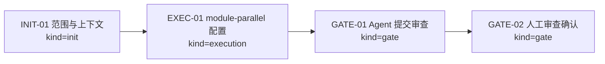
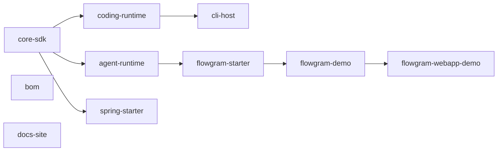

# Visual Map / 可视化图谱

Visual Map Contract: v1.0

本任务图谱说明 module-parallel harness 升级的生命周期和模块 registry 拓扑。

## 图表索引（Map Index）

| ID | Type | Purpose | Required For Understanding | Source Evidence | Promotion Candidate |
| --- | --- | --- | --- | --- | --- |
| MAP-01 | phase | 展示执行阶段和依赖关系 | yes | `task_plan.md`; `progress.md` | no |
| MAP-02 | topology | 展示注册模块及一阶依赖 | yes | `Module-Registry.md`; `harness.yaml` | no |

## 阶段关系图（Phase Graph）

## 模块拓扑图

## 阶段表（Phase Table，表头供 checker 解析）

| Phase ID | Kind | Depends On | State | Completion | Output | Required Evidence | Exit Command | Actor | Evidence Status | Blocking Risk | Owner / Handoff |
| --- | --- | --- | --- | ---: | --- | --- | --- | --- | --- | --- | --- |
| INIT-01 | init | none | done | 100 | 任务计划和执行策略已确认 | `task_plan.md`; `execution_strategy.md` | `harness task-start 2026-06-04-module-parallel-harness-upgrade-d6ab88ce` | agent | present | none | coordinator |
| EXEC-01 | execution | INIT-01 | done | 100 | 启用 module-parallel、注册 10 个模块、补齐模块合同 | diff; `progress.md`; `Module-Registry.md`; module brief/plan | `harness task-phase 2026-06-04-module-parallel-harness-upgrade-d6ab88ce EXEC-01 --state done --completion 100 --evidence present` | agent | present | 依赖拓扑只记录一阶协调关系 | coordinator |
| GATE-01 | gate | EXEC-01 | planned | 0 | Agent Review Submission | `review.md`; `progress.md`; lesson routing | `harness task-review 2026-06-04-module-parallel-harness-upgrade-d6ab88ce --message "
"` | agent | missing | none | coordinator |
| GATE-02 | gate | GATE-01 | planned | 0 | Human Review Confirmation | review packet 和人工确认 | dashboard workbench confirmation | human | missing | Agent 不能代办人工确认 | human |

允许的 `State`：`planned`, `in_progress`, `review`, `blocked`, `done`, `skipped`。

允许的 `Evidence Status`：`missing`, `partial`, `present`, `waived`。

允许的 `Kind`：`init`, `execution`, `gate`。

允许的 `Actor`：`agent`, `human`, `coordinator`。

`Completion` 使用 `0..100` 的整数；dashboard 的实现完成度只由非 skipped 的 `execution` 阶段计算。

## 支持性图表（Supporting Maps）

后续启用 `subagent-worker` 时，应新增 worktree / handoff 拓扑图。
