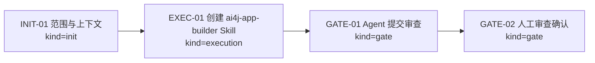
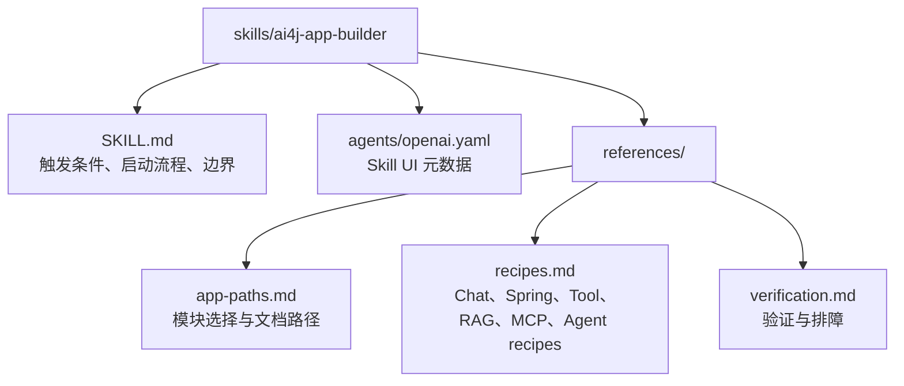
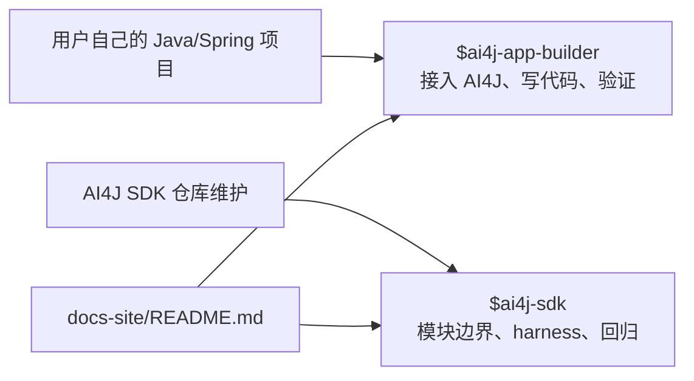

# Visual Map / 可视化图谱

Visual Map Contract: v1.0

## 图表索引（Map Index）

| ID | Type | Purpose | Required For Understanding | Source Evidence | Promotion Candidate |
| --- | --- | --- | --- | --- | --- |
| MAP-01 | phase | 展示 Skill 创建任务生命周期和审查门禁 | yes | `task_plan.md` | no |
| MAP-02 | topology | 展示 app-builder Skill 包内文件关系 | yes | `skills/ai4j-app-builder/**` | no |
| MAP-03 | decision | 展示用户侧 Skill 与维护侧 Skill 的分工 | yes | `docs-site/README.md` | no |

## 阶段关系图（Phase Graph）

## Skill 包结构图（Package Topology）

## Skill 分工图

## 阶段表（Phase Table，表头供 checker 解析）

| Phase ID | Kind | Depends On | State | Completion | Output | Required Evidence | Exit Command | Actor | Evidence Status | Blocking Risk | Owner / Handoff |
| --- | --- | --- | --- | ---: | --- | --- | --- | --- | --- | --- | --- |
| INIT-01 | init | none | done | 100 | 任务计划和执行策略已确认 | `brief.md`; `task_plan.md`; `execution_strategy.md` | `harness task-start 2026-06-05-ai4j-app-builder-user-skill-c784073b` | agent | present | none | coordinator |
| EXEC-01 | execution | INIT-01 | done | 100 | `skills/ai4j-app-builder` 和 README 安装入口已完成 | `skills/ai4j-app-builder/**`; `docs-site/README.md`; commit `c23fb08` | `harness task-log 2026-06-05-ai4j-app-builder-user-skill-c784073b --message "
"` | agent | present | none | coordinator |
| GATE-01 | gate | EXEC-01 | done | 100 | Agent Review Submission | `review.md`; `progress.md`; `lesson_candidates.md` | `harness task-review 2026-06-05-ai4j-app-builder-user-skill-c784073b --message "
"` | agent | present | none | coordinator |
| GATE-02 | gate | GATE-01 | planned | 0 | Human Review Confirmation | review packet 和人工确认 | dashboard workbench confirmation | human | missing | Agent 不能代办人工确认 | human |

允许的 `State`：`planned`, `in_progress`, `review`, `blocked`, `done`, `skipped`。

允许的 `Evidence Status`：`missing`, `partial`, `present`, `waived`。

允许的 `Kind`：`init`, `execution`, `gate`。

允许的 `Actor`：`agent`, `human`, `coordinator`。

`Completion` 使用 `0..100` 的整数；`done` 应为 `100`，`planned` 应为 `0`，`skipped` 不计入 dashboard 总完成度。
