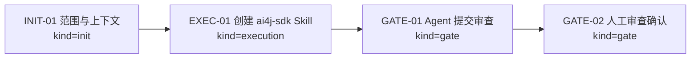
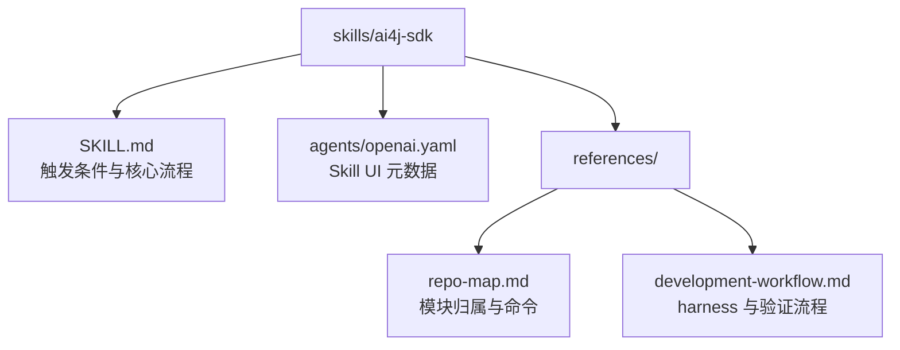

# Visual Map / 可视化图谱

Visual Map Contract: v1.0

## 图表索引（Map Index）

| ID | Type | Purpose | Required For Understanding | Source Evidence | Promotion Candidate |
| --- | --- | --- | --- | --- | --- |
| MAP-01 | phase | 展示任务生命周期和审查门禁 | yes | `task_plan.md` | no |
| MAP-02 | topology | 展示 Skill 包内文件关系 | yes | `skills/ai4j-sdk/**` | no |

## 阶段关系图（Phase Graph）

## Skill 包结构图（Package Topology）

## 阶段表（Phase Table，表头供 checker 解析）

| Phase ID | Kind | Depends On | State | Completion | Output | Required Evidence | Exit Command | Actor | Evidence Status | Blocking Risk | Owner / Handoff |
| --- | --- | --- | --- | ---: | --- | --- | --- | --- | --- | --- | --- |
| INIT-01 | init | none | done | 100 | 任务计划和执行策略已确认 | `task_plan.md`; `execution_strategy.md` | `harness task-start 2026-06-05-ai4j-sdk-project-skill-for-agent-assisted-develo-6ba2130a` | agent | present | none | coordinator |
| EXEC-01 | execution | INIT-01 | done | 100 | `skills/ai4j-sdk` 已创建并通过校验 | `skills/ai4j-sdk/**`; `quick_validate.py` output; commit `3b8af61` | `harness task-phase 2026-06-05-ai4j-sdk-project-skill-for-agent-assisted-develo-6ba2130a EXEC-01 --state done --completion 100 --evidence present` | agent | present | none | coordinator |
| GATE-01 | gate | EXEC-01 | done | 100 | Agent Review Submission | `review.md`; `progress.md`; `lesson_candidates.md` | `harness task-review 2026-06-05-ai4j-sdk-project-skill-for-agent-assisted-develo-6ba2130a --message "
"` | agent | present | none | coordinator |
| GATE-02 | gate | GATE-01 | planned | 0 | Human Review Confirmation | review packet 和人工确认 | `harness review-confirm 2026-06-05-ai4j-sdk-project-skill-for-agent-assisted-develo-6ba2130a --confirm 2026-06-05-ai4j-sdk-project-skill-for-agent-assisted-develo-6ba2130a` | human | missing | Agent 不能代办人工确认 | human |

允许的 `State`：`planned`, `in_progress`, `review`, `blocked`, `done`, `skipped`。

允许的 `Evidence Status`：`missing`, `partial`, `present`, `waived`。

允许的 `Kind`：`init`, `execution`, `gate`。

允许的 `Actor`：`agent`, `human`, `coordinator`。

`Completion` 使用 `0..100` 的整数；`done` 应为 `100`，`planned` 应为 `0`，`skipped` 不计入 dashboard 总完成度。

## 支持性图表（Supporting Maps）

本任务不需要额外 architecture、sequence 或 data-flow 图；产物是独立 Skill 包。
