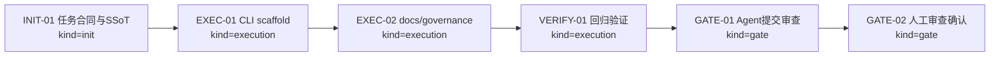
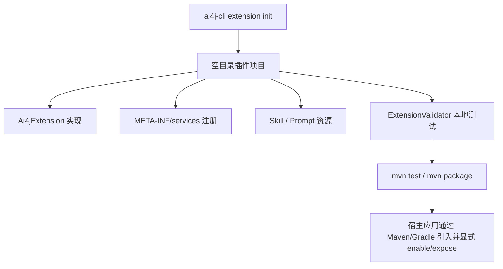

# Visual Map / 可视化图谱

Visual Map Contract: v1.0

## 图表索引（Map Index）

| ID | Type | Purpose | Required For Understanding | Source Evidence | Promotion Candidate |
| --- | --- | --- | --- | --- | --- |
| MAP-01 | phase | 展示 Wave 9 执行阶段和门禁 | yes | `task_plan.md` | no |
| MAP-02 | data-flow | 展示 CLI 生成项目后的作者验证路径 | yes | `plugin-packages.md` | no |

## 阶段关系图（Phase Graph）

## 作者路径图（Scaffold Flow）

## 阶段表（Phase Table，表头供 checker 解析）

| Phase ID | Kind | Depends On | State | Completion | Output | Required Evidence | Exit Command | Actor | Evidence Status | Blocking Risk | Owner / Handoff |
| --- | --- | --- | --- | ---: | --- | --- | --- | --- | --- | --- | --- |
| INIT-01 | init | none | done | 100 | 任务计划和 F-031 已建立 | `task_plan.md`; `docs/09-PLANNING/Feature-SSoT.md` | `harness task-start 2026-06-09-ai4j-extension-plugin-scaffold-wave-9-1923fbfb` | agent | present | none | coordinator |
| EXEC-01 | execution | INIT-01 | done | 100 | `extension init` CLI 实现和测试已完成 | diff; targeted tests | n/a | agent | present | none | coordinator |
| EXEC-02 | execution | EXEC-01 | done | 100 | README、docs-site、Regression/Cadence 更新已完成 | diff | n/a | agent | present | none | coordinator |
| VERIFY-01 | execution | EXEC-02 | done | 100 | 目标回归和 harness status 已记录 | commands in `progress.md` | n/a | agent | present | none | coordinator |
| GATE-01 | gate | VERIFY-01 | done | 100 | Agent Review Submission | `review.md`; `progress.md`; `lesson_candidates.md` | `harness task-review 2026-06-09-ai4j-extension-plugin-scaffold-wave-9-1923fbfb --message "
"` | agent | present | materials incomplete | coordinator |
| GATE-02 | gate | GATE-01 | done | 100 | Human Review Confirmation 已完成 | review packet and human confirmation | Dashboard workbench bulk confirmation | human | present | none | human |

允许的 `State`：`planned`, `in_progress`, `review`, `blocked`, `done`, `skipped`。

允许的 `Evidence Status`：`missing`, `partial`, `present`, `waived`。

允许的 `Kind`：`init`, `execution`, `gate`。

允许的 `Actor`：`agent`, `human`, `coordinator`。
