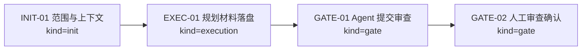

# Visual Map / 可视化图谱

Visual Map Contract: v1.0

本文件记录 AI4J Agent SDK architecture enhancement planning 的阶段、模块边界和后续路线图。

## 图表索引（Map Index）

| ID | Type | Purpose | Required For Understanding | Source Evidence | Promotion Candidate |
| --- | --- | --- | --- | --- | --- |
| MAP-01 | phase | 展示本规划任务的执行阶段和门禁 | yes | `task_plan.md` | no |
| MAP-02 | architecture | 展示 ai4j-agent 增强路线和模块边界 | yes | `references/ai4j-agent-sdk-enhancement-plan.md` | yes |
| MAP-04 | roadmap | 展示执行级路线图和调研门禁 | yes | `references/ai4j-agent-sdk-execution-roadmap-and-research-gates.md` | yes |

## 阶段关系图（Phase Graph）



## 阶段表（Phase Table，表头供 checker 解析）

| Phase ID | Kind | Depends On | State | Completion | Output | Required Evidence | Exit Command | Actor | Evidence Status | Blocking Risk | Owner / Handoff |
| --- | --- | --- | --- | ---: | --- | --- | --- | --- | --- | --- | --- |
| INIT-01 | init | none | done | 100 | 任务计划和执行策略已确认 | `task_plan.md`; `execution_strategy.md` | `harness task-start 2026-06-20-ai4j-agent-sdk-architecture-enhancement-planning-b6a2e312` | agent | present | none | coordinator |
| EXEC-01 | execution | INIT-01 | done | 100 | `ai4j-agent` 增强规划文档、visual map、findings、review 和 lesson candidate 已落盘 | `references/ai4j-agent-sdk-enhancement-plan.md`; `findings.md`; `review.md`; `lesson_candidates.md` | `harness task-log 2026-06-20-ai4j-agent-sdk-architecture-enhancement-planning-b6a2e312 --message "<summary>"` | agent | present | none | coordinator |
| GATE-01 | gate | EXEC-01 | done | 100 | Agent Review Submission | `review.md`、progress update、lesson routing | `harness task-review 2026-06-20-ai4j-agent-sdk-architecture-enhancement-planning-b6a2e312 --message "<summary>"` | agent | present | pending final status check | coordinator |
| GATE-02 | gate | GATE-01 | planned | 0 | Human Review Confirmation | review packet 和人工确认 | `harness review-confirm 2026-06-20-ai4j-agent-sdk-architecture-enhancement-planning-b6a2e312 --confirm 2026-06-20-ai4j-agent-sdk-architecture-enhancement-planning-b6a2e312` | human | missing | Agent 不能代办人工确认 | human |

允许的 `State`：`planned`, `in_progress`, `review`, `blocked`, `done`, `skipped`。

允许的 `Evidence Status`：`missing`, `partial`, `present`, `waived`。

允许的 `Kind`：`init`, `execution`, `gate`。

允许的 `Actor`：`agent`, `human`, `coordinator`。

`Completion` 使用 `0..100` 的整数；`done` 应为 `100`，`planned` 应为 `0`，`skipped` 不计入 dashboard 总完成度。dashboard 的实现完成度只由非 skipped 的 `execution` 阶段计算；`init` 和 `gate` 阶段表达生命周期门禁、下一步命令和责任人，不拉低实现完成度。

## 支持性图表（Supporting Maps）

### MAP-02 ai4j-agent 增强路线

```text
当前基础
  Agent / Runtime / Session / Memory / Tool / Event / Workflow / Team / Trace
        |
        v
P0 SDK 内核
  AgentSession
  SessionEventLog
  MemoryStore
  ContextProjector
  CompactPolicy
  Plugin Lifecycle
        |
        +--------------------+
        |                    |
        v                    v
P1 Agent Blueprint      P2 Sandbox 抽象
  YAML schema             SandboxProvider
  loader/validator        SandboxSession
  factory                 SandboxSpec
        |                    |
        v                    v
P3 ai4j-coding 接入      P4 ai4j-cli 体验
  shell/file/git/browser   /sandbox status/enable/disable/attach
        |
        v
P5 Remote Agent Runner
  ai4j-agent-runner in sandbox
  event stream / artifact / screenshot / remote workspace
```

### 模块边界

```text
ai4j
  模型 SDK 和 provider 基础。

ai4j-agent
  通用 Agent SDK 主入口，承载 Session/Memory/Compact/Event/Plugin lifecycle/Sandbox binding 抽象。

ai4j-extension-api
  插件声明能力，包括 Tool/Command/Hook/UI/Memory/Compact/SandboxProvider。

ai4j-coding
  官方 coding tools 和 workspace 能力，感知可选 sandbox。

ai4j-cli
  官方终端产品，提供 /sandbox、Blueprint 运行、远端 runner attach 等 UX。

ai4j-agent-runner（未来可选）
  可部署到远端 sandbox 的 Agent Runner。
```

## 规划刷新支持图（MAP-03）

```text
AI4J 差异化
  低接入成本 + 好组装 + 插件生态 + CLI/TUI + sandbox agent 产品化
        |
        v
P0 ai4j-agent 内核
  Session / EventLog / Memory / Compact / ContextProjector / Lifecycle
        |
        +--> P1 Blueprint YAML
        +--> P0-C Plugin Lifecycle
        +--> P2 Sandbox SPI
                 |
                 v
              P3 ai4j-coding sandbox routing
                 |
                 v
              P4 ai4j-cli /sandbox + TUI
                 |
                 v
              P5 Remote Agent Runner decision
```

MAP-03 Source Evidence: `references/ai4j-agent-sdk-complete-planning-refresh.md`

### MAP-04 执行级路线图

```text
R0 Source-backed Research
  Pi / Codex / Claude Code / OpenCode / Spring AI / LangChain4j / AgentScope Java / Sandbox providers
        |
        v
P0 ai4j-agent 内核
  P0-A Session runtime container
  P0-B Memory Compact Context Projector
  P0-C Plugin Lifecycle Hooks
  P0-D Approval / Permission Policy
        |
        v
P1 YAML Agent Blueprint
  schema -> loader -> validator -> AgentFactory -> CLI run
        |
        v
P2 Sandbox SPI
  fake provider -> session binding -> extension provider contribution
        |
        v
P3 ai4j-coding sandbox routing
  shell/file/git/browser/project run/test runner
        |
        v
P4 ai4j-cli TUI
  ai4j command -> slash commands -> renderer -> /sandbox -> Harness bridge
        |
        v
P5 Remote Agent Runner decision
  protocol contract -> event stream -> artifacts -> optional Maven module
```

MAP-04 Source Evidence: `references/ai4j-agent-sdk-execution-roadmap-and-research-gates.md`
