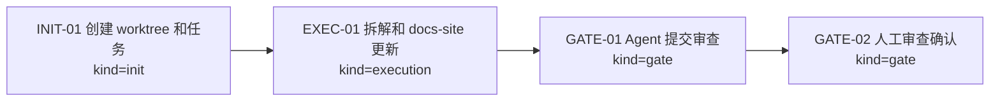
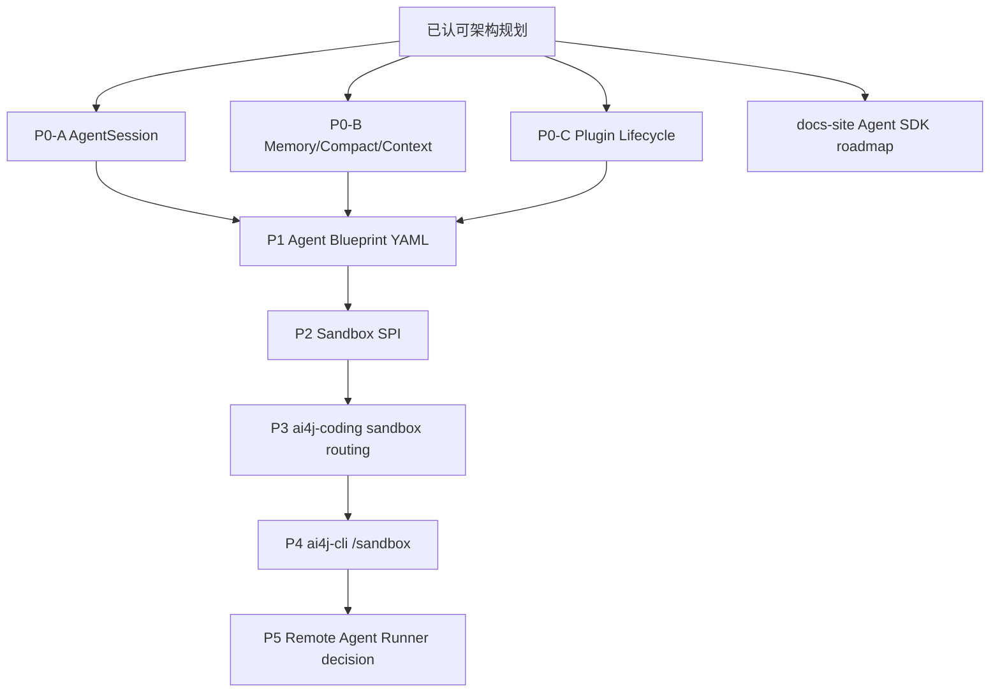
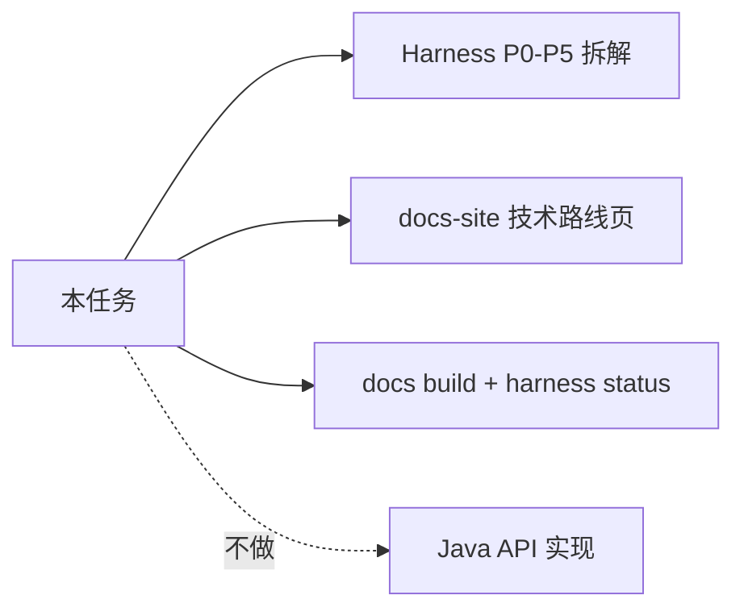

# Visual Map / 可视化图谱

Visual Map Contract: v1.0

## 图表索引（Map Index）

| ID | Type | Purpose | Required For Understanding | Source Evidence | Promotion Candidate |
| --- | --- | --- | --- | --- | --- |
| MAP-01 | phase | 展示本任务执行阶段和门禁 | yes | `task_plan.md` | no |
| MAP-02 | roadmap | 展示 P0-P5 实施队列 | yes | `references/ai4j-agent-implementation-roadmap.md` | no |
| MAP-03 | scope | 展示本任务范围和排除项 | yes | `execution_strategy.md` | no |

## 阶段关系图（Phase Graph）

## 阶段表（Phase Table，表头供 checker 解析）

| Phase ID | Kind | Depends On | State | Completion | Output | Required Evidence | Exit Command | Actor | Evidence Status | Blocking Risk | Owner / Handoff |
| --- | --- | --- | --- | ---: | --- | --- | --- | --- | --- | --- | --- |
| INIT-01 | init | none | done | 100 | worktree 和任务包已创建 | `git worktree list`; `task_plan.md`; `execution_strategy.md` | `harness task-start 2026-06-20-ai4j-agent-sdk-implementation-decomposition-and-26846add` | agent | present | none | coordinator |
| EXEC-01 | execution | INIT-01 | done | 100 | P0-P5 拆解和 docs-site roadmap 已写入 | `references/ai4j-agent-implementation-roadmap.md`; `docs-site/docs/agent/sdk-roadmap.md`; `docs-site/sidebars.ts` | `harness task-phase 2026-06-20-ai4j-agent-sdk-implementation-decomposition-and-26846add EXEC-01 --state done --completion 100 --evidence present` | agent | present | final harness clean check pending | coordinator |
| GATE-01 | gate | EXEC-01 | done | 100 | Agent Review Submission | `review.md`; docs build; harness status | `harness task-review 2026-06-20-ai4j-agent-sdk-implementation-decomposition-and-26846add --message "
"` | agent | present | none | coordinator |
| GATE-02 | gate | GATE-01 | planned | 0 | Human Review Confirmation | review packet 和人工确认 | dashboard workbench confirmation | human | missing | Agent 不能代办人工确认 | human |

## P0-P5 Roadmap

## 当前任务范围

## Evidence Map

| Evidence | Path |
| --- | --- |
| P0-P5 decomposition | `references/ai4j-agent-implementation-roadmap.md` |
| docs-site page | `docs-site/docs/agent/sdk-roadmap.md` |
| navigation | `docs-site/sidebars.ts` |
| build | `docs-site` `npm run build` |
