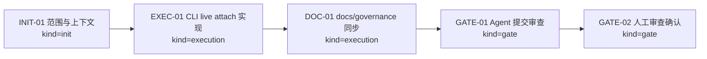
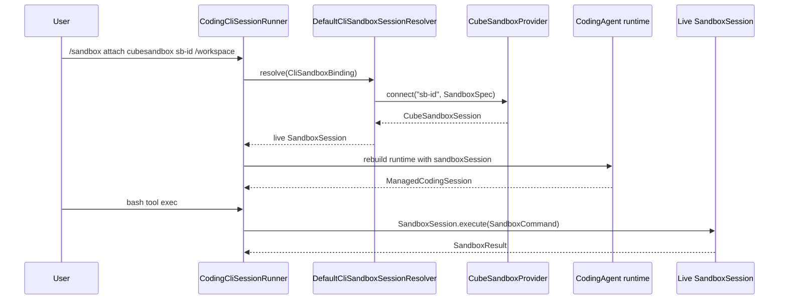

# Visual Map / 可视化图谱

Visual Map Contract: v1.0

## 图表索引（Map Index）

| ID | Type | Purpose | Required For Understanding | Source Evidence | Promotion Candidate |
| --- | --- | --- | --- | --- | --- |
| MAP-01 | phase | 展示执行阶段和依赖关系 | yes | `task_plan.md` / `progress.md` | no |
| MAP-02 | sequence | 展示 `/sandbox attach cubesandbox` 路由 | yes | CLI runtime/resolver tests | no |

## 阶段关系图（Phase Graph）

## 阶段表（Phase Table，表头供 checker 解析）

| Phase ID | Kind | Depends On | State | Completion | Output | Required Evidence | Exit Command | Actor | Evidence Status | Blocking Risk | Owner / Handoff |
| --- | --- | --- | --- | ---: | --- | --- | --- | --- | --- | --- | --- |
| INIT-01 | init | none | done | 100 | 任务计划和边界确认 | `task_plan.md`; `findings.md` | n/a | agent | present | none | coordinator |
| EXEC-01 | execution | INIT-01 | done | 100 | CLI resolver/runtime/tests | diff; Maven tests | n/a | agent | present | live env unavailable but non-blocking | coordinator |
| DOC-01 | execution | EXEC-01 | done | 100 | docs-site 与 Regression/Cadence 同步 | docs build; docs diff | n/a | agent | present | none | coordinator |
| GATE-01 | gate | DOC-01 | done | 100 | Agent Review Submission | `review.md`; `walkthrough.md`; `lesson_candidates.md` | n/a | agent | present | none | coordinator |
| GATE-02 | gate | GATE-01 | planned | 0 | Human Review Confirmation | human review evidence | `harness review-confirm 2026-06-21-cubesandbox-live-install-and-coding-sandbox-rout-fd63343a --confirm 2026-06-21-cubesandbox-live-install-and-coding-sandbox-rout-fd63343a` | human | missing | Agent 不能代办人工确认 | human |

## `/sandbox attach cubesandbox` 路由图

