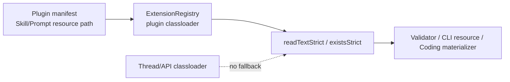

# Visual Map / 可视化图谱

Visual Map Contract: v1.0

## 图表索引（Map Index）

| ID | Type | Purpose | Required For Understanding | Source Evidence | Promotion Candidate |
| --- | --- | --- | --- | --- | --- |
| MAP-01 | phase | 展示执行阶段和依赖关系 | yes | `task_plan.md` / `progress.md` | no |
| MAP-02 | data-flow | 展示插件资源 strict read 的信任边界 | yes | code diff | no |

## 阶段关系图（Phase Graph）

## 阶段表（Phase Table，表头供 checker 解析）

| Phase ID | Kind | Depends On | State | Completion | Output | Required Evidence | Exit Command | Actor | Evidence Status | Blocking Risk | Owner / Handoff |
| --- | --- | --- | --- | ---: | --- | --- | --- | --- | --- | --- | --- |
| INIT-01 | init | none | done | 100 | 任务计划和执行策略已确认 | `task_plan.md`; `execution_strategy.md` | `harness task-start 2026-07-05-plugin-ecosystem-hardening-fixes-bcef4a36` | agent | present | none | coordinator |
| EXEC-01 | execution | INIT-01 | done | 100 | 版本、CLI lifecycleHooks、strict resource reads、ask_user cap、docs permission 边界已实现 | diff、`findings.md` | n/a | agent | present | none | coordinator |
| REG-01 | execution | EXEC-01 | done | 100 | Maven/package/docs-site 回归已通过 | `progress.md` E-002; Cadence SRB-060 | n/a | agent | present | none | coordinator |
| GATE-01 | gate | REG-01 | done | 100 | Agent self-review 无重要发现 | `review.md` | `harness task-review 2026-07-05-plugin-ecosystem-hardening-fixes-bcef4a36` | agent | present | none | coordinator |
| CLOSE-01 | gate | GATE-01 | in_progress | 80 | walkthrough、SSoT/Cadence、提交/PR 收口 | `walkthrough.md`; git commit | `harness task-complete 2026-07-05-plugin-ecosystem-hardening-fixes-bcef4a36` | agent | present | 等待最终提交/PR | coordinator |

允许的 `State`：`planned`, `in_progress`, `review`, `blocked`, `done`, `skipped`。
允许的 `Evidence Status`：`missing`, `partial`, `present`, `waived`。
允许的 `Kind`：`init`, `execution`, `gate`。
允许的 `Actor`：`agent`, `human`, `coordinator`。

## 支持性图表（Supporting Maps）

