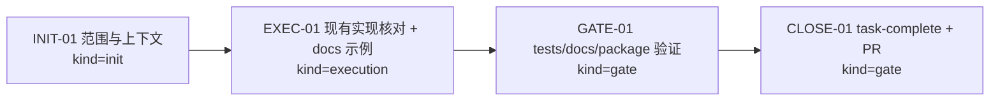
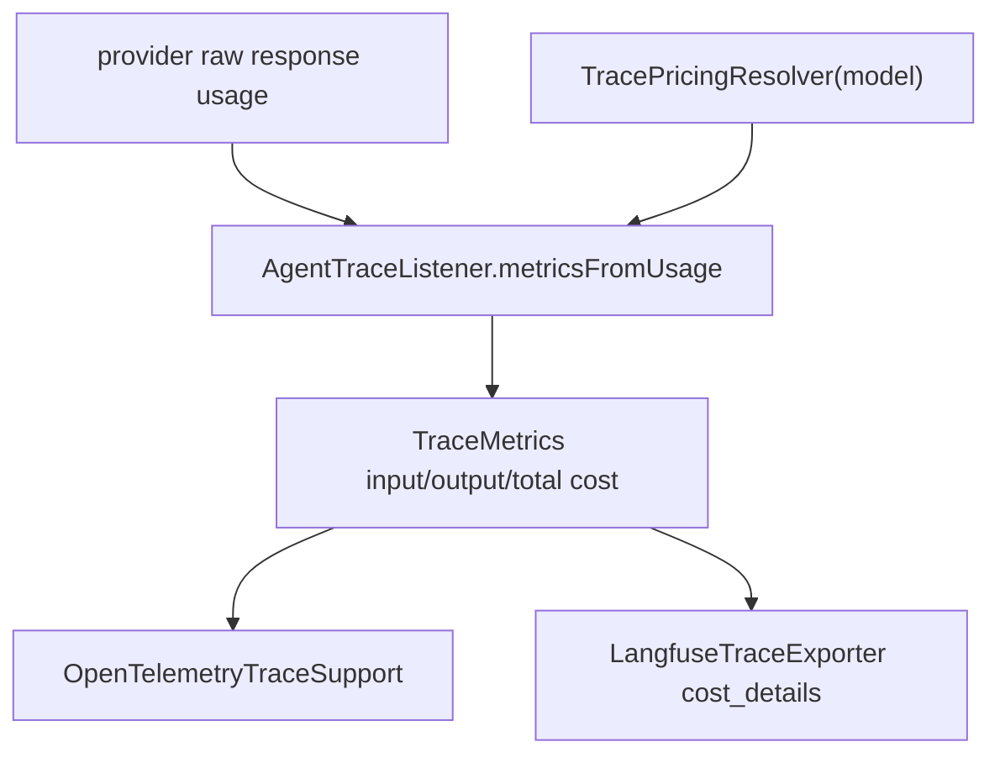

# Visual Map / 可视化图谱

Visual Map Contract: v1.0

## 图表索引（Map Index）

| ID | Type | Purpose | Required For Understanding | Source Evidence | Promotion Candidate |
| --- | --- | --- | --- | --- | --- |
| MAP-01 | phase | 展示本任务为什么是 docs/verification 而不是新 runtime 实现 | yes | `task_plan.md`, `progress.md` | no |

## 阶段关系图（Phase Graph）

## 阶段表（Phase Table，表头供 checker 解析）

| Phase ID | Kind | Depends On | State | Completion | Output | Required Evidence | Exit Command | Actor | Evidence Status | Blocking Risk | Owner / Handoff |
| --- | --- | --- | --- | ---: | --- | --- | --- | --- | --- | --- | --- |
| INIT-01 | init | none | done | 100 | 任务边界确认：不重复实现 cost API，只文档化既有 trace pricing | `task_plan.md` | `harness task-start 2026-07-06-rag-cost-calculation-506a5b0b` | agent | present | none | coordinator |
| EXEC-01 | execution | INIT-01 | done | 100 | docs-site trace pricing resolver 示例和治理记录已完成 | docs diff、Regression SSoT、Cadence Ledger | n/a | agent | present | none | coordinator |
| GATE-01 | gate | EXEC-01 | done | 100 | trace targeted tests、docs-site typecheck/build、package smoke 已通过 | `progress.md` command evidence | n/a | agent | present | none | coordinator |
| CLOSE-01 | gate | GATE-01 | done | 100 | 提交后运行 task-complete、PR、merge、worktree cleanup | commit / PR / merge evidence | `npx --yes coding-agent-harness task-complete 2026-07-06-rag-cost-calculation-506a5b0b --message "Trace cost docs verified" .` | agent | present | none | coordinator |

允许的 `State`：`planned`, `in_progress`, `review`, `blocked`, `done`, `skipped`。
允许的 `Evidence Status`：`missing`, `partial`, `present`, `waived`。
允许的 `Kind`：`init`, `execution`, `gate`。
允许的 `Actor`：`agent`, `human`, `coordinator`。

## 支持性图表（Supporting Maps）

