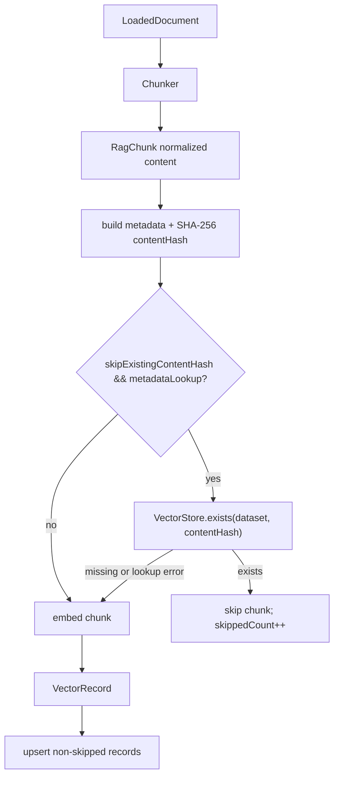

# Visual Map / 可视化图谱

Visual Map Contract: v1.0

本文件是任务图表集合，不只是阶段路线图。只有对人或 agent 理解任务有实际帮助的图才放进来。

## 图表索引（Map Index）

| ID | Type | Purpose | Required For Understanding | Source Evidence | Promotion Candidate |
| --- | --- | --- | --- | --- | --- |
| MAP-01 | phase | 展示执行阶段和依赖关系 | yes | `task_plan.md` / `progress.md` | no |
| MAP-02 | data-flow | 展示增量 ingest 的数据流和 skip 点 | yes | `IngestionPipeline.java` | no |

## 阶段关系图（Phase Graph）

## 阶段表（Phase Table，表头供 checker 解析）

| Phase ID | Kind | Depends On | State | Completion | Output | Required Evidence | Exit Command | Actor | Evidence Status | Blocking Risk | Owner / Handoff |
| --- | --- | --- | --- | ---: | --- | --- | --- | --- | --- | --- | --- |
| INIT-01 | init | none | done | 100 | 任务边界已清楚到可以执行 | `task_plan.md` | `harness task-start 2026-07-06-rag-incremental-ingest-content-hash-7112b274` | agent | present | none | coordinator |
| EXEC-01 | execution | INIT-01 | done | 100 | `contentHash`、`skipExistingContentHash`、`VectorStore.exists`、后端 lookup、starter binding、docs-site 已完成 | diff、`progress.md` command evidence | `harness task-phase 2026-07-06-rag-incremental-ingest-content-hash-7112b274 EXEC-01 --state done --completion 100 --evidence present` | agent | present | none | coordinator |
| GATE-01 | gate | EXEC-01 | in_progress | 90 | core/starter/docs/package gates 已通过，等待最终 diff hygiene/PR | `review.md`、`walkthrough.md`、`progress.md` | `harness task-complete 2026-07-06-rag-incremental-ingest-content-hash-7112b274 --message "
"` | agent | present | final commit pending | coordinator |

允许的 `State`：`planned`, `in_progress`, `review`, `blocked`, `done`, `skipped`。

允许的 `Evidence Status`：`missing`, `partial`, `present`, `waived`。

允许的 `Kind`：`init`, `execution`, `gate`。

允许的 `Actor`：`agent`, `human`, `coordinator`。

`Completion` 使用 `0..100` 的整数；`done` 应为 `100`，`planned` 应为 `0`，`skipped` 不计入 dashboard 总完成度。

## 支持性图表（Supporting Maps）

