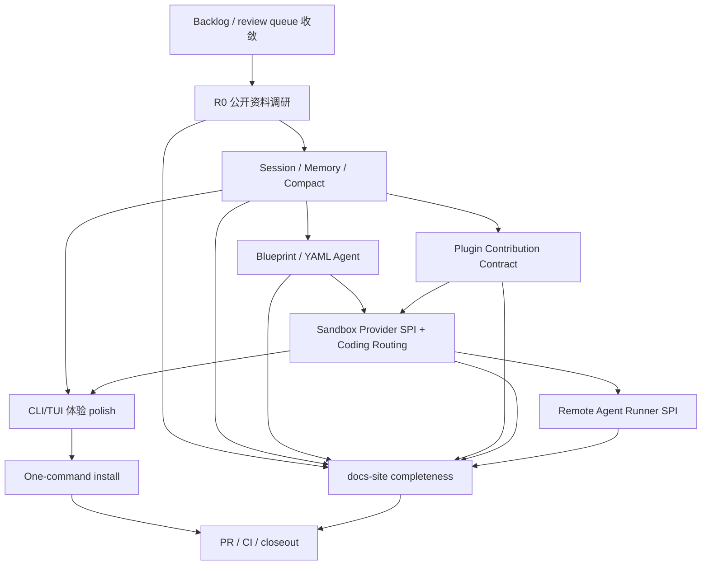

# Agent SDK 任务拆解

这一页把 AI4J Agent SDK、Coding Agent CLI/TUI、插件生态、Sandbox、Remote Runner 和 docs-site 的后续工作拆成可执行任务。

它不是发布公告。每一项是否已经可用，以对应源码、测试、CLI 命令和文档页面为准。

## 总目标

AI4J 后续要同时做好三件事：

1. **Java Agent SDK 更好用**：让 Java 开发者低成本接入 Agent、Memory、Compact、Tool、Workflow、Plugin、Permission、Sandbox。
2. **Agent 可组装**：用 YAML Blueprint、插件贡献点、Sandbox Provider、Remote Runner SPI 让开发者和第三方扩展能力。
3. **Coding Agent 体验更像成熟终端 Agent**：用户安装后输入 `ai4j`，能进入交互式会话，切换 provider/model/session，查看 memory/compact/sandbox/plugin/permissions。

## 当前基线

当前 `dev` 已经有不少基础能力：

| 领域 | 当前基线 | 继续阅读 |
| --- | --- | --- |
| 公开资料调研 | 已有 R0 source-backed digest | [R0 公开资料调研](./source-backed-research-digest) |
| 真实 API 对照 | 已有 Agent SDK real API matrix | [真实 API 能力矩阵](./real-api-matrix) |
| Session / Memory / Compact | `AgentSession`、memory、compact report、context projector | [Session Runtime](./session-runtime)、[Memory Compact Context](./memory-compact-context) |
| YAML Blueprint | loader、validator、AgentFactory、schema、CLI run | [Agent Blueprint YAML](./agent-blueprint) |
| Plugin | manifest、resources、contribution metadata、lifecycle hooks、guardrail | [Plugin Contribution Contract](./plugin-contribution-contract) |
| Permission | allow / deny / require approval 策略合同 | [Approval Permission Policy](./approval-permission-policy) |
| Sandbox | Sandbox SPI、session binding、coding shell routing、CLI `/sandbox` | [Sandbox SPI](./sandbox-spi)、[Coding Sandbox Routing](/docs/coding-agent/sandbox-routing) |
| Remote Runner | Agent Runner SPI contract | [Remote Agent Runner SPI](./remote-agent-runner-spi) |
| CLI/TUI | JLine TUI、slash commands、status context bar、provider/model/session/sandbox 等入口 | [CLI and TUI](/docs/coding-agent/cli-and-tui)、[Command Reference](/docs/coding-agent/command-reference) |

## 任务队列

| 优先级 | 任务 | 主模块 | 当前状态口径 | 最小验证 |
| ---: | --- | --- | --- | --- |
| 0 | Backlog / review queue 收敛 | Harness | 每轮实现前先确认 `review` 是待确认还是代码缺失 | `npx --yes coding-agent-harness status --json .` |
| 1 | R0 source-backed research | `docs-site` | 已有 digest，后续补 source gap | docs build + source links |
| 2 | Session / Memory / Compact 收口 | `ai4j-agent` + `ai4j-cli` | Agent 基座已存在，重点补 CLI 可诊断体验 | agent/cli targeted tests |
| 3 | Blueprint / YAML Agent hardening | `ai4j-agent` + `ai4j-cli` | 基座已存在，补 schema/fixture/docs | blueprint/CLI tests |
| 4 | Plugin contribution contract | `ai4j-extension-api` + `ai4j-agent` + `ai4j-cli` | 贡献元数据已存在，补第三方生态体验 | extension/agent/cli tests |
| 5 | Sandbox Provider SPI + coding tool routing | `ai4j-agent` + `ai4j-coding` + `ai4j-cli` | SPI、shell routing、CLI status 已有首版 | sandbox/coding/cli tests |
| 6 | Remote Agent Runner SPI | `ai4j-agent` | SPI 已有，补 fake runner 场景和 artifact/checkpoint docs | runner contract tests |
| 7 | CLI/TUI 体验 polish | `ai4j-cli` | 坚持 Java + JLine，补 slash palette、渲染和 tmux smoke | CLI tests + tmux smoke |
| 8 | One-command install | `ai4j-cli` | 需要 ADR 和最小 launcher prototype | packaging smoke |
| 9 | docs-site completeness pass | `docs-site` | 逐页补真实示例、边界和排障 | `npm --prefix docs-site run build` |
| 10 | PR / CI / closeout loop | Harness + affected modules | 每个切片都要 PR、CI、merge、walkthrough | `gh pr checks --watch` + Harness status |

## 依赖关系



## 每个切片怎么验收

### Session / Memory / Compact

必须证明：

- `AgentSession` 状态、event log、snapshot 和 compact report 能稳定保存。
- CLI `/memory`、`/compact`、`/compacts` 展示的是可诊断信息，而不是只打印一句话。
- compact 不保存 token、secret、sandbox 连接串。

推荐命令：

```powershell
mvn -pl ai4j-agent -am "-Dtest=*Memory*,*Compact*,*Session*" -DskipTests=false -DfailIfNoTests=false test
mvn -pl ai4j-cli -am "-Dtest=*Memory*,*Compact*,SlashCommandControllerTest" -DskipTests=false -DfailIfNoTests=false test
```

### Blueprint / YAML Agent

必须证明：

- YAML schema、loader、validator 和 factory 使用同一套字段。
- YAML 只引用 provider/profile/plugin/tool 名称，不写密钥。
- CLI run 的错误提示能指出缺失字段或不支持配置。

### Plugin contribution contract

必须证明：

- 插件能声明贡献了哪些 tool、command、hook、prompt、skill、memory、sandbox provider 或 runner provider。
- 用户能查看贡献点，但危险能力不会因为安装自动暴露。
- 官方示例插件能作为第三方作者参考。

### Sandbox / Remote Runner

必须证明：

- 无 sandbox 时保持 direct host runtime。
- 有 live sandbox 时执行型工具不能静默回退宿主机。
- metadata-only attach 明确提示它只是绑定摘要。
- fake provider / fake runner 可以覆盖生命周期、事件流、artifact 和失败路径。

### CLI/TUI

必须证明：

- 当前 provider/model/session/memory/compact/sandbox/permissions 状态可见。
- slash command 可发现。
- markdown/code/diff/tool call/approval/error 能分块渲染。
- 至少有 parser/view model/runtime dispatch/ACP 或 tmux smoke 其中一类证据。

## 分发安装路线

`ai4j` 的安装体验需要单独做 ADR，不要在规划里提前拍死。候选方案：

| 方案 | 优点 | 风险 |
| --- | --- | --- |
| zip + scripts | Java 项目最直接，可控 | 体验不如包管理器。 |
| JBang | Java CLI 友好 | 用户需要接受 JBang。 |
| npm wrapper | AI/前端用户熟悉 `npm i -g` 或 `npx` | Java CLI 变成 Node wrapper，维护两层分发。 |
| native-image | 终端体验好 | 构建和兼容成本高。 |
| Scoop/Homebrew/Sdkman | 正式分发友好 | 适合稳定后。 |

首版建议先做 zip/scripts 或 JBang 的可验证 prototype，同时记录 npm wrapper 的取舍。

## docs-site 写作规则

后续每个能力页都要覆盖：

1. 解决什么问题。
2. 什么时候该用，什么时候不该用。
3. 最小真实 Java / YAML / CLI 示例。
4. 核心 API / 字段解释。
5. 与其他模块关系。
6. 安全边界和限制。
7. 常见错误和排查。
8. 源码、测试或 demo 入口。
9. 下一步链接。

明确禁止：

- 不写不存在的 API。
- 不把 roadmap 写成已发布能力。
- 不把具体 OpenAI-compatible 中转平台名写成 SDK 架构概念。
- 不把真实 provider token 写进任何示例。
- 不使用“企业采用”这类不自然措辞。

## 下一步建议

如果只推进一个开发切片，优先做 **CLI `/memory` + `/compact` UX**。它最能验证 AgentSession / Compact 是否真的好用，也最贴近用户想要的 Codex / Claude Code 类终端体验。

完整任务内拆解保存在 Harness：

`coding-agent-harness/planning/modules/docs-site/tasks/2026-06-21-agent-sdk-task-decomposition-and-technical-docs-5ac6fa9e/references/agent-sdk-task-decomposition-2026-06-21.md`
